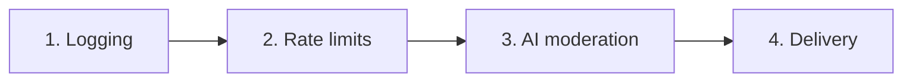

# syn-horse-notifications — AGENTS.md

Cloudflare Workers queue consumer that runs paging messages through a
four-stage pipeline: **logging → rate limits → AI moderation → delivery**.

This file is the AI-agent context. Humans should read [README.md](README.md).

## Cloudflare Workers knowledge may be stale

STOP. Your training data on Workers APIs, KV, R2, D1, Durable Objects, Queues,
Vectorize, Workers AI, and Agents SDK may be outdated. Always retrieve current
documentation before any Workers task.

- <https://developers.cloudflare.com/workers/>
- MCP: <https://docs.mcp.cloudflare.com/mcp>
- Limits: retrieve from each product's `/platform/limits/` page (e.g. `/workers/platform/limits`)
- Errors: <https://developers.cloudflare.com/workers/observability/errors/>
- Error 1102 = CPU/memory exceeded; check the limits page.

Conditional best-practice docs (read only if you're touching these):

- Durable Objects: <https://developers.cloudflare.com/durable-objects/best-practices/rules-of-durable-objects/>
- Workflows: <https://developers.cloudflare.com/workflows/build/rules-of-workflows/>

## Architecture

Entry point: `src/index.ts` — a queue consumer. For each `MessageBatch` element:

1. Validate the body against `messageSchema` (Zod, `src/schema.ts`).
   - Failure → `console.error` and `ack()`. Never retry malformed payloads.
2. Run the four stages in order. Each returns `CONTINUE` or `STOP`.
   `STOP` means the stage has already taken terminal action (logged a
   drop). `ack()` and move on.
3. Any thrown exception → `retry()` so transient failures get replayed.



| Stage         | File                        | Status                                  | What it does                                 |
| ------------- | --------------------------- | --------------------------------------- | -------------------------------------------- |
| logging       | `src/stages/logging.ts`     | live                                    | `INSERT` into D1 `log` table                 |
| rate limits   | `src/stages/rate-limits.ts` | live                                    | KV-backed per-source counters with fail-open |
| AI moderation | `src/stages/ai.ts`          | **stub** — always `accept`/`none`       | Will classify via OpenAI-compatible LLM      |
| delivery      | `src/stages/delivery.ts`    | **stub** — hard-wired to `stub` adapter | Will dispatch via `Adapter`                  |

## Code map

| Path                                              | Purpose                                                                                                        |
| ------------------------------------------------- | -------------------------------------------------------------------------------------------------------------- |
| `src/index.ts`                                    | Queue handler — entry point                                                                                    |
| `src/schema.ts`                                   | Inbound message Zod schema + parse/guard helpers                                                               |
| `src/types.ts`                                    | `Adapter` interface, `Notification` type                                                                       |
| `src/constants.ts`                                | `RATE_LIMITS`, `RATE_LIMIT_TTL_SECONDS`, KV key builder                                                        |
| `src/db.ts`                                       | D1 `INSERT`/`UPDATE` helpers, one per stage                                                                    |
| `src/kv.ts`                                       | KV counter read/write with TTL preservation                                                                    |
| `src/stages/types.ts`                             | `CONTINUE` / `STOP` singletons                                                                                 |
| `src/stages/{logging,rate-limits,ai,delivery}.ts` | One file per pipeline stage                                                                                    |
| `src/adapters/index.ts`                           | Adapter registry (exhaustive `switch`)                                                                         |
| `src/adapters/{email,ntfy,pushover,stub}.ts`      | Adapter implementations. `stub` is a working no-op; `email`, `ntfy`, and `pushover` are stubbed pending wiring |
| `migrations/0001_create_log_table.sql`            | D1 schema                                                                                                      |

## Bindings (`wrangler.jsonc`)

| Binding                       | Type                           | Used by                           | Notes                                                                                                                     |
| ----------------------------- | ------------------------------ | --------------------------------- | ------------------------------------------------------------------------------------------------------------------------- |
| `DB`                          | D1 (`syn-horse-notifications`) | all four stages                   | Each stage `UPDATE`s the same row keyed by message id                                                                     |
| `KV`                          | KV namespace                   | rate-limits stage                 | Per-source counters                                                                                                       |
| `AI`                          | Workers AI                     | not yet                           | AI stage will likely use an OpenAI-compatible endpoint instead                                                            |
| `MEDIA` / `IMAGES` / `STREAM` | Media bindings                 | not yet                           | Reserved                                                                                                                  |
| `send_email`                  | Email Workers                  | `src/adapters/email.ts` (stubbed) | Verified destination `syn@syn.as`. Bound as `env.EMAIL` (= `send_email[0].name` in `wrangler.jsonc`); type is `SendEmail` |
| Queue consumer                | Queues                         | `index.ts`                        | `syn-horse-notifications`                                                                                                 |

Run `bun run types` (`= wrangler types`) after any binding change.

## Commands

| Command                    | What it does                                                   |
| -------------------------- | -------------------------------------------------------------- |
| `bun run dev`              | Local Wrangler dev (auto-applies D1 migrations locally)        |
| `bun run deploy`           | Deploy to Cloudflare                                           |
| `bun run types`            | Regenerate `worker-configuration.d.ts`                         |
| `bun run lint`             | ESLint + trunk + tsc                                           |
| `bun run lint:fix`         | Autofix ESLint + trunk                                         |
| `bun run lint:types`       | TypeScript typecheck only                                      |
| `bun run format`           | Prettier + trunk format                                        |
| `bun run db:migrate`       | Apply D1 migrations to **remote**                              |
| `bun run db:migrate:local` | Apply D1 migrations locally — usually unnecessary, see Gotchas |

## Schemas

**Inbound message** (`src/schema.ts`, `strictObject` — unknown fields rejected):

```ts
{
  channel: "red" | "green",
  contact: string,            // 1..256, trimmed
  message: string,            // 1..8192, trimmed
  source?: IPv4 | IPv6 | RFC-1123 hostname,
}
```

**D1 `log` table** (`migrations/0001_create_log_table.sql`):

`id` = queue `message.id` (primary key). Message columns set by stage 1
(`contact`, `message`, `channel`, `source`); state columns are `NULL`
until the relevant stage `UPDATE`s them. `CHECK` constraints encode the
enum values for `channel`, `*_decision`, `*_violation`, and `result`.

| Column                 | Set by                               | Values                                                |
| ---------------------- | ------------------------------------ | ----------------------------------------------------- |
| `rate_limit_decision`  | stage 2                              | `accept` \| `drop`                                    |
| `rate_limit_violation` | stage 2                              | `none` \| `hour` \| `day` \| `lifetime` \| `kv_error` |
| `ai_decision`          | stage 3                              | `accept` \| `drop`                                    |
| `ai_violation`         | stage 3                              | `none` \| `fun` \| `nonsense` \| `spam`               |
| `adapter`              | stage 4                              | adapter name                                          |
| `result`               | stage 2/3 on drop, stage 4 otherwise | `dropped` \| `delivered` \| `failed`                  |
| `result_reason`        | stage 4 on failure                   | free text                                             |

**KV keys** (`src/constants.ts`):

```text
rate-limits:<source-or-"unknown">:<hour|day|lifetime>
```

Value: integer counter as a string. Metadata: `{ expiresAt: number }`
storing the original absolute expiry so subsequent writes don't slide
the window forward.

## Caps and tunables

| Setting                            | Value      | Defined at             |
| ---------------------------------- | ---------- | ---------------------- |
| Hourly cap per source              | 10         | `RATE_LIMITS.hour`     |
| Daily cap per source               | 100        | `RATE_LIMITS.day`      |
| Lifetime cap per source            | 1000       | `RATE_LIMITS.lifetime` |
| Message body max                   | 8192 chars | `messageSchema`        |
| Contact max                        | 256 chars  | `messageSchema`        |
| Truncation threshold (log summary) | 60 chars   | `formatMessageSummary` |

## AI moderation — label mapping (when wired up)

The four labels emitted by the moderation LLM map to log-row state as
follows. Until the live call lands, `runAi` always records the "real
page" row.

| Label      | `ai_decision` | `ai_violation` | `result`       | Next stage           |
| ---------- | ------------- | -------------- | -------------- | -------------------- |
| Real page  | `accept`      | `none`         | (stage 4 sets) | delivery             |
| Fun / joke | `accept`      | `fun`          | (stage 4 sets) | delivery             |
| Nonsense   | `drop`        | `nonsense`     | `dropped`      | skip — return `STOP` |
| Spam       | `drop`        | `spam`         | `dropped`      | skip — return `STOP` |

The `PROMPT` constant in `src/stages/ai.ts` is tuned for Llama-class
small models served via an OpenAI-compatible endpoint: flat bullets,
five few-shot examples, explicit `Output:` anchor, message body wrapped
in triple-backtick fences as a soft prompt-injection defence.

## Gotchas (non-obvious)

- **`db:migrate:local` is usually a no-op.** Wrangler/NuxtHub auto-applies
  local D1 migrations on `bun run dev`. Don't reach for it as a "fix" step.
- **Rate-limit windows never slide.** First write to a counter sets an
  absolute `expiresAt`; subsequent writes reuse it via KV metadata.
  Never overwrite the expiry.
- **`source` missing → `"unknown"` bucket.** All unattributed pages share
  a single counter, so omitting `source` is not a rate-limit bypass.
- **KV failures are fail-open.** A KV outage records
  `rate_limit_violation = 'kv_error'` and lets the message through. Don't
  "fix" this by failing the message — the operator wants noise during a
  KV incident, not silence. Query `WHERE rate_limit_violation = 'kv_error'`
  to see incidents.
- **Counters increment on accept only.** Rejected messages don't consume
  quota in the longer windows.
- **Message id is the log primary key.** All four stages `UPDATE` the same
  row by `id` (= `MessageBatch.messages[i].id`, 32 hex chars).
- **Tightest window first.** `RATE_LIMIT_PERIODS = ["hour","day","lifetime"]` —
  ensures the most specific violation is reported when several caps are
  breached at once.
- **AI stage is a stub.** `runAi` always records `accept`/`none`. The
  `PROMPT` is ready, the LLM call isn't.
- **Adapters `email`, `ntfy`, and `pushover` are stubs.** They return `true`
  without network I/O. The `stub` adapter is the only live one and is
  hard-coded in `runDelivery` today.
- **EJS template uses `<%= %>` (HTML-escaped).** Message bodies with
  `<`/`>`/`&` are escaped in the rendered prompt. Fine for LLM input; if
  switching to `<%- %>` for accuracy, harden the prompt-injection defence
  first (the user could otherwise close the `\`\`\`` fence and inject).
- **`compatibility_flags` is `nodejs_compat`, not `nodejs_compat_v2`.** The
  unprefixed flag is a superset: with our `2026-05-13` compat date it
  enables v2's unenv polyfills _and_ exposes Workers' virtual `node:fs`
  module (available since compat date `2025-09-01`). EJS imports
  `node:fs` at module top-level even for in-memory `ejs.render(str, data)`
  calls, so without the plain `nodejs_compat` flag the Worker fails to
  load with `No such module "node:fs"`. Don't "tidy up" to the v2-suffixed
  flag — it freezes the runtime surface and re-breaks EJS.
- **Malformed payloads are `ack()`'d, not `retry()`'d.** Bad schema can't
  be made valid by retrying.

## JSDoc

This project requires JSDoc on every exported declaration in `src/`. This
overrides any default-system-prompt guidance about minimising comments —
JSDoc here is documentation, not commentary, and it's load-bearing for
IDE hover, `{@link}` navigation, and future API surface review.

Rules:

- One JSDoc block above every exported function, type, interface, const,
  class, and default export. Internal helpers MAY carry JSDoc when the
  WHY is non-trivial; they SHOULD when the helper has subtle invariants.
- Do NOT include `@param {Type}` or `@returns {Type}` annotations.
  TypeScript types are authoritative and the typed JSDoc form drifts
  silently when signatures change. Use `@param name - description` and
  `@returns description` prose only.
- Lead with what the symbol IS in one sentence, then a blank line, then
  the WHY (constraint, design choice, surprising behaviour). Restating
  what the type already says is not useful.
- Cross-reference related symbols with `{@link OtherSymbol}`. Editors
  surface these as clickable links — favour them over bare names in prose.
- For stubbed or unfinished symbols, add a `NOTE:` paragraph describing
  what the production behaviour will be. This replaces ad-hoc `// TODO`
  comments inside bodies and is visible at every call site via hover.
- Use British English in prose (`behaviour`, `summarise`, `colour`).
- Use `@throws` for documented error conditions, `@see` for external
  references (URLs, spec links), and `@deprecated` when retiring a symbol.

## Commits

GitMoji + Conventional Commits (per global rules). Examples:

- `✨ feat(stages/ai): wire OpenAI-compatible moderation call`
- `🐛 fix(rate-limits): preserve absolute expiresAt on retry`
- `📝 docs: rewrite AGENTS.md and add README.md`
- `🗃️ chore(db): add result_reason index for failed-delivery dashboards`

Full body should explain the **why**, not just the what. Co-authoring is
fine.

<!-- skilld -->

Before modifying code, evaluate each installed skill against the current task.
For each skill, determine YES/NO relevance and invoke all YES skills before proceeding.

<!-- /skilld -->
