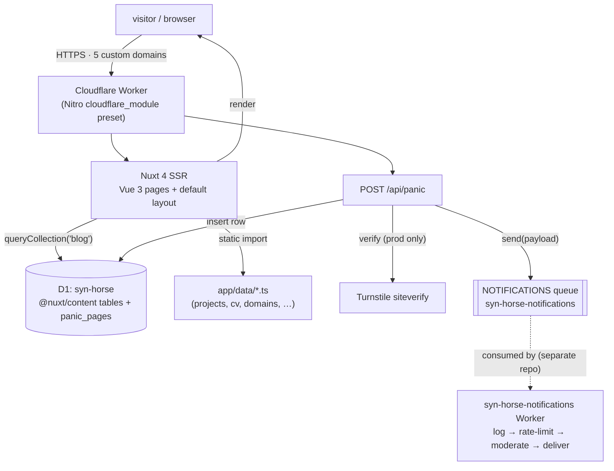
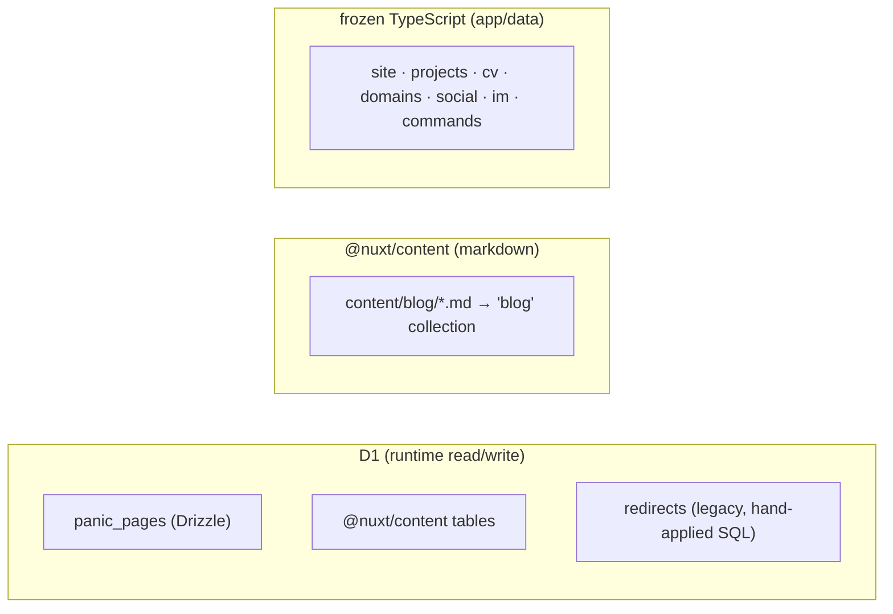
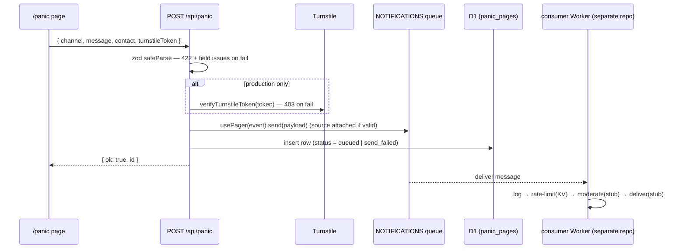
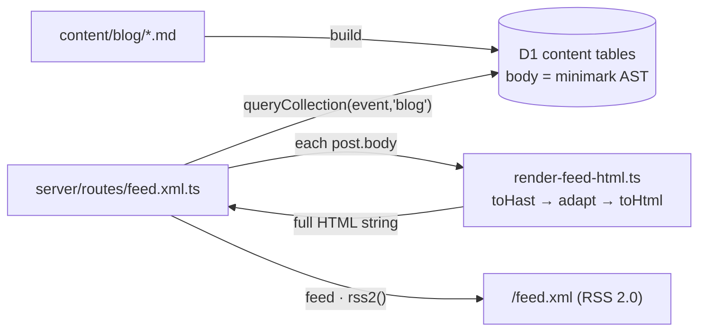

# APP.md — syn.horse application guide

<!-- trunk-ignore-all(trunk-toolbox/todo) -->

> A planning-oriented map of the application: what exists, how it fits together, where
> new features slot in, and what is already queued. For **agent** working rules read
> [`AGENTS.md`](./AGENTS.md) (the authoritative project doc); for **human** setup read
> [`README.md`](./README.md). This file is the bridge: it assumes you know roughly what
> the project is and want to decide what to build next.
>
> _Last reconciled to code: 2026-06-29._

---

## Contents

1. [What this is](#1-what-this-is)
2. [Architecture at a glance](#2-architecture-at-a-glance)
3. [Tech stack](#3-tech-stack)
4. [Surface area — pages, routes, hidden things](#4-surface-area)
5. [Data & content model](#5-data--content-model)
6. [Frontend structure](#6-frontend-structure)
7. [Cloudflare platform & bindings](#7-cloudflare-platform--bindings)
8. [External integrations](#8-external-integrations)
9. [The panic paging pipeline](#9-the-panic-paging-pipeline)
10. [Build, dev, deploy & verify](#10-build-dev-deploy--verify)
11. [Extension points — where a new feature slots in](#11-extension-points)
12. [Feature backlog & opportunities](#12-feature-backlog--opportunities)
13. [Constraints, gotchas & do-not-touch](#13-constraints-gotchas--do-not-touch)
14. [Reference map](#14-reference-map)
15. [Planned feature: RSS feed (designed)](#15-planned-feature-rss-feed-at-feedxml-designed)

---

## 1. What this is

`syn.horse` is the personal site of syn (Dave) — "a queer pixel-future shouting into the
void". It is a **Nuxt 4 (SSR) application deployed as a single Cloudflare Worker**, serving
a small set of hand-built pages, a markdown-driven blog, and one real backend feature: a
`/panic` paging form that enqueues a notification and records the attempt.

It is intentionally small, opinionated, and design-led. The look-and-feel is frozen in
`_design/` (an export from Claude Design) and re-implemented with Tailwind v4 + daisyUI 5
tokens. There is no CMS, no auth, no user accounts — content is either markdown
(`content/blog/`) or typed TypeScript modules (`app/data/`). The only thing that writes to
the database at runtime is the panic endpoint.

Served on five custom domains (each with `www.`): **syn.horse, syn.as, syn.haus, syn.pink,
dcw.soy** — all the same Worker.

**The mental model for planning:** the _front of house_ (pages, blog, design) is mature and
mostly cosmetic to extend; the _back of house_ (one API route, one D1 table, a queue
producer) is deliberately minimal but sits on a Worker that is already provisioned with far
more capability than it currently uses (see §7 and §11).

---

## 2. Architecture at a glance



Request flow in words:

- Every request hits the **one Worker**. Nitro's `cloudflare_module` preset bundles the Nuxt
  server + the Workers runtime entry. There is **no separate API service** — `/api/**` routes
  are Nitro file routes inside the same Worker.
- Page renders are **SSR**, then hydrated. `@nuxt/content` runs an **in-browser SQLite WASM**
  module so client-side blog navigation can query without a round-trip (this is why the CSP
  carries `wasm-unsafe-eval`). The content database lives in **D1** (`content.database.type =
"d1"`, binding `DB`).
- The deploy wrangler config is **generated** to `.output/server/wrangler.json` from the inline
  `nitro.cloudflare.wrangler` block in `nuxt.config.ts`. There is deliberately **no
  `wrangler.{json,jsonc,toml}` at the repo root** (auto-discovery would duplicate every
  binding). Dev bindings come from the non-discoverable `wrangler.dev.jsonc`.

---

## 3. Tech stack

| Layer           | Choice                                                                                                                                          | Notes                                                                                                                      |
| --------------- | ----------------------------------------------------------------------------------------------------------------------------------------------- | -------------------------------------------------------------------------------------------------------------------------- |
| Package manager | **bun** `1.3.14` (pinned)                                                                                                                       | ESM only (`"type": "module"`). Everything via `bun run …`.                                                                 |
| Framework       | **Nuxt 4.4** (`compatibilityVersion: 4`, `srcDir: app/`)                                                                                        | Vue 3.5, vue-router 5.                                                                                                     |
| Server          | **Nitro** (nitropack 2.13)                                                                                                                      | `preset: "cloudflare_module"`, `nodeCompat: true`.                                                                         |
| Deploy target   | **Cloudflare Workers** (wrangler 4)                                                                                                             | Smart placement, 30 s CPU limit, observability + source maps on.                                                           |
| Styling         | **Tailwind v4** (`@tailwindcss/vite`) + **daisyUI 5**                                                                                           | Single bespoke `synhorse` theme; built-in themes off. **No `tailwind.config`** — theme lives in `app/assets/css/main.css`. |
| Database        | **Cloudflare D1** + **drizzle-orm 0.45** / drizzle-kit 0.31                                                                                     | Local drizzle tooling uses `better-sqlite3` / `@libsql/client`.                                                            |
| Content         | **@nuxt/content 3**                                                                                                                             | `blog` collection, D1-backed, queried at runtime.                                                                          |
| Validation      | **zod 4**                                                                                                                                       | v4 API: issue key is `error`, not `message`.                                                                               |
| OG images       | **@takumi-rs/core + /wasm**                                                                                                                     | Renders `app/components/OgImage/*.takumi.vue` — **scaffolded, not yet wired** (see §8).                                    |
| Fonts           | **@nuxt/fonts** (Google provider)                                                                                                               | VT323 (display), Inter (100–900 + italic), Space Mono (100–800 + italic).                                                  |
| Nuxt modules    | `@nuxt/icon`, `@nuxt/image`, `@nuxt/scripts`, `@nuxt/eslint`, `@nuxthub/core`, `nuxt-security`, `nuxt-gtag`, `@nuxtjs/turnstile`, `@nuxtjs/seo` | See §8.                                                                                                                    |
| Tooling         | eslint 10 (flat) + prettier 3 + trunk; tsc/vue-tsc for types                                                                                    | `ctx7` (Context7) + `skilld` dev deps generate agent skills.                                                               |
| Tests           | **none wired**                                                                                                                                  | `x:test*` scripts exist but vitest/playwright are **not installed**. See §10.                                              |

Dependencies worth knowing about for planning: `openai`/`uuid`/`@catppuccin/*`/`untun` are
present but largely historical or optional — IDs are generated with global
`crypto.randomUUID()`, not the `uuid` package. The 2026-05-09 review flagged a dependency
audit (see §12).

---

## 4. Surface area

### 4.1 Pages (routes)

All under `app/pages/`. Static pages follow one pattern (`useSeoMeta(...)` + import from
`~/data/*` + `.page-shell` template); the blog uses `@nuxt/content`.

| Route          | File                                    | Kind                         | Data source                                                                  |
| -------------- | --------------------------------------- | ---------------------------- | ---------------------------------------------------------------------------- |
| `/`            | `index.vue`                             | static                       | `app/data/site.ts`, links                                                    |
| `/now`         | `now.vue`                               | static                       | hardcoded in template + `SITE.status`                                        |
| `/projects`    | `projects.vue`                          | static                       | `app/data/projects.ts` (`PROJECTS` + `ABANDONED_PROJECTS`)                   |
| `/cv`          | `cv.vue`                                | static                       | `app/data/cv.ts` (`CV_ROLES`, `TALKS`, `SIDE`)                               |
| `/contact`     | `contact.vue`                           | static                       | `app/data/social.ts`, `app/data/im.ts`                                       |
| `/domains`     | `domains.vue`                           | static                       | `app/data/domains.ts` (`DOMAINS`)                                            |
| `/panic`       | `panic.vue`                             | interactive form             | POSTs to `/api/panic`; Turnstile widget                                      |
| `/blog`        | `blog/index.vue`                        | content list                 | `queryCollection("blog")`, tag filter                                        |
| `/blog/<slug>` | `blog/[slug].vue`                       | content page                 | `queryCollection("blog").path(...)`; 404 on miss; hides `future` outside dev |
| `/void`        | `void.vue`                              | **hidden** (`layout: false`) | konami/easter-egg surface                                                    |
| 404 / 500      | `error.vue` + `components/NotFound.vue` | error                        | wraps default layout                                                         |

### 4.2 Server routes & API

The backend is intentionally tiny — **one route**:

- `server/api/panic.post.ts` → **`POST /api/panic`**. Validates (zod 4 `safeParse`, 422 with
  field issues), verifies Turnstile in production (403; skipped under `import.meta.dev`),
  enqueues via `usePager(event)`, then records a `panic_pages` row. Returns `{ ok, id }`.
- Auto-imported server utils (`server/utils/`):
  - `db.ts` → `useDb(event)` — a Drizzle client over `event.context.cloudflare.env.DB`.
  - `pager.ts` → `usePager(event)`, `extractSource(event)`, types `QueueMessage` / `Pager`,
    and the `source` validators (`HOSTNAME_RE` / `IPV4_RE` / `IPV6_RE`, kept byte-identical to
    the consumer Worker).

`/api/**` route rules (in `nuxt.config.ts`) already attach CORS, `Cache-Control: no-cache`,
`X-Content-Type-Options: nosniff`, `X-Frame-Options: DENY`, `X-XSS-Protection: 0` — so new API
routes inherit those for free.

### 4.3 Hidden surfaces & easter eggs

These are real features, not throwaways, and they share extension patterns worth reusing:

- **Command palette** — press `/` anywhere. `app/composables/useCommandPalette.ts` holds the
  global `isOpen`/`query` state; `app/data/commands.ts` holds `COMMANDS` (+ `KONAMI_COMMANDS`);
  rendered by `app/components/layout/CommandPalette.vue`.
- **Konami code** — `↑ ↑ ↓ ↓ ← → ← → B A`. A small composable suite
  (`useKonamiCode`/`useKonamiState`/`useKonamiToast`) wired by `layout/KonamiOrchestrator.vue`
  and `layout/KonamiBoot.vue`. Toggling it reveals `ABANDONED_PROJECTS` in the `/projects`
  grid and surfaces `KONAMI_COMMANDS` in the palette.
- **`/void`** — a hidden page (`layout: false`).
- **Static text easter eggs** — `public/sudo`, `public/git`, `public/gpg/*`, `public/ssh/*`
  served as plain text on purpose (do not modify; see §13).

---

## 5. Data & content model

There are **three distinct data substrates**. The first planning decision for any feature is
_which one it touches_.



### 5.1 D1 — the only write path

- **Database:** `syn-horse` (binding `DB`, id `2722c422-…`). Preview db id `deab36c7-…`.
- **Drizzle schema:** `server/db/schema.ts` defines **only `panic_pages`**:

  ```typescript
  panic_pages {
    id: text primary key            // crypto.randomUUID()
    channel: text enum red|green     // schema-driven enum
    message: text                    // 10–2000 chars
    contact: text                    // 3–200 chars
    createdAt: integer timestamp
    status: text enum queued|send_failed
    queueError: text | null
    queuedAt: integer timestamp | null
  }
  ```

  `channel` and `status` are **schema-driven enums** — declared once as `text({ enum: [...] })`,
  with `Channel` / `PageStatus` derived via `$inferSelect` (frontend) and `z.enum(col.enumValues)`
  (server). Never duplicate the literal union.

- **Migrations:** `server/db/migrations/sqlite/00NN_*.sql` (currently `0000_stale_omega_sentinel`,
  `0001_burly_kinsey_walden`, `0002_fast_elektra`), drizzle-kit metadata under `meta/`.
- **`redirects`** is **not** a Drizzle table — it is a legacy hand-applied table in
  `sql/redirects.sql`. Treat it as out-of-band; its future is itself a backlog question (§12).

### 5.2 Blog content (`@nuxt/content`)

- Source: `content/blog/*.md` (currently **18 posts**, `0000_*`–`0017_*`), exposed as the
  `blog` collection (`content.config.ts`, `type: "page"`, prefix `/blog`).
- Frontmatter schema (zod): `path` (must match `^/blog/[a-z0-9-]+$`), `date` (`YYYY-MM-DD`),
  `title` (2–100), `description` (10–280), `tags` (string[]), `read` (`^\d+ min$`),
  `future` (bool, default false).
- Querying: `queryCollection("blog")`. The index orders by `date DESC` and, **outside dev**,
  filters `where("future", "=", false)`. The `[slug]` page resolves by `.path(route.path)` and
  404s on miss. So `future: true` is the draft mechanism (visible in dev, hidden in prod).

### 5.3 Static data modules (`app/data/*.ts`)

Typed, frozen-ish content. Each exports `interface` + `const`:

| Module        | Exports                                                 | Drives                                                          |
| ------------- | ------------------------------------------------------- | --------------------------------------------------------------- |
| `site.ts`     | `SITE` (`name, status, description, url, github, feed`) | **single source of truth** for status string / urls / feed link |
| `projects.ts` | `PROJECTS`, `ABANDONED_PROJECTS`, `ProjectTag`          | `/projects` (abandoned shown only in konami mode)               |
| `cv.ts`       | `CV_ROLES`, `TALKS`, `SIDE`                             | `/cv`                                                           |
| `domains.ts`  | `DOMAINS`, `DomainStatus`, `DomainCls`                  | `/domains`                                                      |
| `social.ts`   | `SOCIAL`                                                | `/contact`                                                      |
| `im.ts`       | `IM`                                                    | `/contact`                                                      |
| `commands.ts` | `COMMANDS`, `KONAMI_COMMANDS`, `Command`                | command palette                                                 |

There is **no `posts.ts`** — the blog is markdown, not a data module.

---

## 6. Frontend structure

### 6.1 Layout shell

`app/layouts/default.vue` is the integration hub — every page renders inside it:

```text
default.vue
├─ <LayoutFxLayer/>            FX overlays (scanlines, grain, vignette, glitch)
├─ <LayoutStatusBar/>          sticky top bar — live clock + uptime (ClientOnly)
├─ <LayoutNavBar/>             nav tabs + pixel logo mark
├─ <main><slot/></main>        the page
├─ <LayoutCommandPalette/>     '/'-triggered palette
└─ <LayoutKonamiOrchestrator/> konami listener + effects
```

`app/error.vue` re-wraps content in `<NuxtLayout name="default">` and renders `NotFound.vue`
for 404s / a generic fallback otherwise.

### 6.2 Components

Auto-imported with **path-prefixed names**: `components/layout/StatusBar.vue` →
`<LayoutStatusBar/>`; top-level `components/NotFound.vue` → `<NotFound/>`.

- `components/ui/` — primitives: `Tag.vue`, `Console.vue`.
- `components/layout/` — `StatusBar`, `NavBar`, `FxLayer`, `CommandPalette`, `KonamiToast`,
  `KonamiBoot`, `KonamiOrchestrator`.
- `components/OgImage/*.takumi.vue` — 5 OG-image templates (`BlogPost`, `Docs`, `General`,
  `NuxtSeo`, `ProductCard`) rendered via @takumi-rs. **Currently scaffolded / not wired by
  page code** (several still read "Ejected!") — a known backlog item (§12).

### 6.3 Composables (`app/composables/*.ts`)

- `useClock` / `useTime` — clock + uptime for the status bar. **Never read `Date.now()` outside
  `onMounted`** in SSR-rendered components (drift / hydration mismatch).
- `useCommandPalette` — global `isOpen` + `query` state.
- `useKonamiCode` / `useKonamiState` / `useKonamiToast` — the konami suite.
- Auto-imported client util: `app/utils/format-blog-date.ts` → `formatBlogDate()`.

### 6.4 Design system & theme

The visual language is **frozen** in `_design/` (do not modify). It is re-implemented in
`app/assets/css/main.css`, which contains, in order: the `@theme` token block (palette, type
scale, spacing, easings, glow shadows, animations), the `@plugin "daisyui/theme"` mapping
(daisyUI semantic roles → tokens), `@layer components` named classes, and the FX overlays +
a `prefers-reduced-motion` block at the bottom.

Use the **named tokens and component classes**, not raw values — e.g. `bg-void`, `text-paper`,
`text-hot`/`cool`/`lilac`, `font-display`/`sans`/`mono`; classes like `.page-shell`,
`.page-h1`, `.eyebrow`, `.lede`, `.tg` (+ flat modifiers `.hot/.cool/.warn/.lilac/.solid/.on`),
`.btn-syn`, `.console`, `.diamond-list`. CSS keyframes are **global** (duplicate names collide
silently). Full catalogue lives in `AGENTS.md` ("Component classes" / "Theme tokens").

---

## 7. Cloudflare platform & bindings

The single most useful planning fact: **the Worker is provisioned with far more capability
than the app currently uses.** Several bindings are bound in production with zero app code
behind them — building a feature on them needs no new infrastructure.

| Binding               | Type                                           | Emulated in `bun run dev`? | Used by app today?                                 |
| --------------------- | ---------------------------------------------- | -------------------------- | -------------------------------------------------- |
| `DB`                  | D1 database (`syn-horse`)                      | ✅ yes                     | ✅ `@nuxt/content` + `panic_pages`                 |
| `KV`                  | KV namespace                                   | ✅ yes                     | ⚠️ via NuxtHub/framework; little/no direct app use |
| `CACHE`               | KV namespace                                   | ✅ yes                     | ⚠️ framework cache                                 |
| `BLOB`                | R2 bucket                                      | ✅ yes                     | ❌ not used by app code                            |
| `NOTIFICATIONS`       | Queue **producer** (`syn-horse-notifications`) | ✅ yes                     | ✅ `/api/panic`                                    |
| `CF_VERSION_METADATA` | version metadata                               | ✅ yes                     | version badge plumbing                             |
| `AI`                  | Workers AI                                     | ❌ remote-only             | ❌ **unused**                                      |
| `BROWSER`             | Browser Rendering                              | ❌ remote-only             | ❌ **unused**                                      |
| `IMAGES`              | Images                                         | ❌ remote-only             | ❌ **unused**                                      |
| `ANALYTICS`           | Analytics Engine dataset (`syn-horse`)         | ❌ remote-only             | ❌ **unused**                                      |
| `ASSETS`              | Workers static assets                          | deploy-only                | serves `public/` + build output                    |

Why some bindings are **not** emulated locally: wrangler's `getPlatformProxy()` switches to a
remote authenticated session the moment any binding lacks local Miniflare emulation, which
would break offline dev. So `AI`/`BROWSER`/`IMAGES`/`ANALYTICS` are **commented out** in
`wrangler.dev.jsonc` and only exist in the deploy block. If you build a feature on one of them,
you will need an authenticated remote-bindings dev session (or stub it locally).

Worker runtime facts that constrain features: **30 s CPU limit** (`limits.cpu_ms`), smart
placement, `nodejs_compat` + `nodejs_compat_populate_process_env`, observability + invocation
logs + uploaded source maps on (the 2026-05-09 review queued revisiting how revealing those
are post-launch).

> ⚠️ **Verify before building on R2:** the bucket name differs between `hub.blob.bucketName`
> (`blob-syn-horse`) and the deploy `r2_buckets` block (`syn-horse`). Confirm which bucket the
> `BLOB` binding actually resolves to before relying on it.

---

## 8. External integrations

- **Turnstile** (`@nuxtjs/turnstile`) — bot check on `/panic`. Site key is public
  (`runtimeConfig.public.turnstile.siteKey` + `vars`); the secret is a Workers secret
  `NUXT_TURNSTILE_SECRET_KEY` (without it, every prod submission 403s). `verifyTurnstileToken()`
  is **auto-imported** — do not `import … from "#turnstile"` (breaks the Nitro build).
- **Notifications consumer** — `NOTIFICATIONS` producer feeds a **separate Worker in its own
  repo**, `syn-horse-notifications`. It runs log → rate-limit (KV) → AI moderation (stub) →
  delivery (stub; email/ntfy/Pushover scaffolded). **Do not edit it from this repo.** The wire
  envelope is `{ channel, contact, message, source? }`; `pager.ts`'s `source` validators must
  stay byte-identical to the consumer's `HOSTNAME_RE`.
- **SEO** (`@nuxtjs/seo`) — sitemap/robots/OG/schema-org. `site.url = https://syn.horse`,
  `indexable: true`. Per-page metadata today is just `useSeoMeta({ title, description })`;
  canonical URLs, `og:image`, article metadata, and OG-image wiring are **not yet done** (§12).
- **Analytics** (`nuxt-gtag`) — Google tag. (`ANALYTICS` Analytics Engine dataset is separate
  and unused.)
- **Fonts** (`@nuxt/fonts`) — Google provider, served from `/_fonts/`.
- **NuxtHub** (`@nuxthub/core`) — provides the KV/R2/D1 wiring + the migration plugin.
- **Security** (`nuxt-security`) — `sri: true`, hashed scripts/styles, security headers, a
  tuned CSP (`script-src` includes `'wasm-unsafe-eval'` for @nuxt/content's SQLite WASM). This
  constrains the frontend: **avoid inline `:style` bindings** — bind a class, put the dynamic
  value in CSS.

`runtimeConfig` exposes (public) `apiBase: "/api"`, `buildTime`, `commitHash`, `siteUrl`,
`cloudflare.accountId`, `turnstile.siteKey`; (private) `turnstile.secretKey`,
`cloudflare.d1Token` — both overridden by environment variables.

---

## 9. The panic paging pipeline

This is the one end-to-end backend feature and the reference template for "validate → verify
→ enqueue → record" work.



Notes for extending it:

- **Producer-side state only.** This repo records `queued` / `send_failed`. Whether a message
  was actually _delivered_ lives in the consumer's own D1 (`syn-horse-notifications`), not here.
  A real "did it page me?" view needs a way to read that back (a top backlog item — §12).
- **Dev bypass** is deliberate: under `import.meta.dev` the widget is hidden and verify is
  skipped (avoids a `missing-input-secret` 400 when the 1Password `.env` FIFO is already drained).
- `extractSource(event)` derives `source` from the leftmost `X-Forwarded-For`, falling back to
  `CF-Connecting-IP`, and only attaches it if it matches an IPv4/IPv6/hostname shape.

---

## 10. Build, dev, deploy & verify

All via bun (authoritative list: `package.json` `scripts`).

```bash
bun run dev                 # Nuxt dev on :3000; local CF bindings via Miniflare (wrangler.dev.jsonc)
bun run build               # nuxt build → wrangler types (regenerates worker-configuration.d.ts)
bun run preview             # build, then wrangler dev against .output/
bun run deploy              # stamp buildtime+hash → build → wrangler deploy  ⚠️ explicit request only
bun run deploy:nonprod      # wrangler versions upload (preview version, no prod promote)

bun run db:generate         # drizzle-kit generate → server/db/migrations/sqlite/
bun run db:migrate:local    # wrangler d1 migrations apply syn-horse --local  --config wrangler.dev.jsonc
bun run db:migrate:remote   # wrangler d1 migrations apply syn-horse --remote --config wrangler.dev.jsonc
bun run db:studio           # drizzle-kit studio
```

**Verify gate (run before claiming a code task done):**

1. `bun run lint:types` — `tsc --noEmit`, must pass clean.
2. `bun run lint` — eslint + trunk + types together. Auto-fix with `bun run lint:fix` then
   `bun run format`, then re-run.
3. If bindings or DB schema changed: `bun run build` (also regenerates `worker-configuration.d.ts`).

> ⚠️ **There is no working test runner.** The `x:test*` scripts call `vitest`/`playwright`,
> neither of which is installed. "Run the tests" is currently impossible — verify changes
> manually via `bun run dev` / `bun run preview`, or raise installing a runner. This is in
> tension with the global "test everything" rule; flag it, don't silently skip.
>
> ⚠️ **`bun run lint` has known noise** (per the 2026-05-09 review): `lint:eslint` lints the
> frozen `_DIO/`/`_DSOY/`/`_design/` dirs, and `lint:trunk` flags installed agent-skill files.
> Making the gate green is itself a backlog item (§12).

**Migration application** — the two docs disagree and it is worth knowing before you run them:
`AGENTS.md` (and Serena `core`) say local migrations **auto-apply via NuxtHub** on
`bun run dev`; `README.md:63` says migrations sit at a non-default path NuxtHub **doesn't**
watch. The safe operational truth: **remote is always explicit** (`bun run db:migrate:remote`);
for local, run `bun run db:migrate:local` and don't assume auto-apply. `db:generate` produces
no diff when you only touch a schema `enum` array. Reconciling this wording is a doc task (§12).

---

## 11. Extension points

Where each kind of new feature physically goes, with the existing pattern to copy.

### Add a page

Create `app/pages/<name>.vue`. Pattern (see `app/pages/now.vue`):

```vue
<script setup lang="ts">
import { SITE } from "~/data/site"
useSeoMeta({ title: `name · ${SITE.name}`, description: "…" })
</script>
<template>
  <div class="page-shell">
    <div class="eyebrow">▶ /name</div>
    <h1 class="page-h1">name<span class="dot">.</span></h1>
    <!-- … component classes from main.css … -->
  </div>
</template>
```

Add it to the nav (`components/layout/NavBar.vue`) and/or the command palette
(`app/data/commands.ts`) if it should be discoverable.

### Add a server API route

Create `server/api/<name>.<method>.ts` (Nitro file routing → `/<method>` on `/api/<name>`).
Copy `panic.post.ts`: validate with zod `safeParse` (return `createError({ statusCode: 422, … })`),
use `useDb(event)` for D1, `crypto.randomUUID()` for IDs. CORS + no-cache + nosniff headers are
already attached by the `/api/**` route rule.

### Add a D1 table / column

1. Edit `server/db/schema.ts` (use `text({ enum: [...] })` for fixed value sets; derive types).
2. `bun run db:generate` → inspect the new `00NN_*.sql`.
3. `bun run db:migrate:local`, test, then `bun run db:migrate:remote` before deploying code that
   needs the new shape.

### Add blog content

Drop `content/blog/00NN_<slug>.md` with the required frontmatter (§5.2). Set `future: true`
to keep it draft (hidden in prod, visible in dev). Put images under `public/images/blog/` and
reference them as `/images/blog/…` (several existing posts have broken/relative paths — §12).

### Add a second content collection

Edit `content.config.ts` (`defineCollection`) and query it with `queryCollection("<name>")`.
This is the path for, e.g., a `notes`/`til`/`talks` collection.

### Add a static data module

Create `app/data/<name>.ts` exporting an `interface` + `const`, consume it in a page with
`import { … } from "~/data/<name>"`. Frontend may type-only-import from the server schema
(`import type { Channel } from "~~/server/db/schema"`) at zero runtime cost.

### Add a command-palette entry

Append to `COMMANDS` (or `KONAMI_COMMANDS`) in `app/data/commands.ts`. No component changes
needed.

### Add OG images / per-page social metadata

Templates already exist in `app/components/OgImage/*.takumi.vue` but are **unwired**. Wiring
them (via `@nuxtjs/seo`'s OG-image support) plus richer `useSeoMeta` per page/post is a
self-contained feature (§12, "SEO & sharing").

### Build on an unused Cloudflare capability

`AI`, `BROWSER`, `IMAGES`, `ANALYTICS`, `BLOB` (R2) are bound but unused (§7). Access them via
`event.context.cloudflare.env.<BINDING>` in a server route. Local dev needs an authenticated
remote-bindings session for the remote-only ones — uncomment the relevant block in
`wrangler.dev.jsonc`. **Retrieve current Cloudflare docs before using any of these** (the
`cloudflare` / `agents-sdk` / `workers-best-practices` skills exist for exactly this).

---

## 12. Feature backlog & opportunities

Synthesised from `TODO.md` (the running deferral list, chiefly a structured 2026-05-09 review)
and reorganised by **theme + readiness**. Tags: 🟢 quick win · 🟡 needs design/decision ·
🔴 blocked on the consumer Worker landing.

### Headline features

- 🟢 **RSS feed at `/feed.xml`.** Linked from home + blog footers today but **404s**. Needs
  `server/routes/feed.xml.ts` reading from `queryCollection`. Also: wire `SITE.feed` everywhere
  instead of hardcoding `/feed.xml`, and add `<link rel="alternate" type="application/rss+xml">`.
  _Probably the single highest-value, lowest-risk feature._ **→ fully designed & reviewed in
  [§15](#15-planned-feature-rss-feed-at-feedxml-designed); ready to implement.**
- 🟡 **Mobile breakpoints.** The frozen design ships **no `@media` queries**; headings overflow
  narrow viewports. Wants responsive rules for the two-column layouts (home, contact, projects,
  blog rows, domains, CV) and nav/status-bar collapse. Cross-cutting; design-led.
- 🔴 **Notification log API + DB consolidation.** Add an endpoint so the consumer writes its
  logs to _this_ repo's D1, letting us drop the consumer's separate DB binding/database. Unlocks
  a future "did it page me / delivery status" view. Blocked on consumer work.
- 🔴 **Retry policy + dead-letter handling** on the consumer side (once it lands).
- 🟡 **Second `Pager` implementation** (e.g. a direct synchronous channel) — extend `usePager()`
  to choose by channel/runtime config, if/when needed.
- 🟡 **`queued`-row lifecycle** — decide whether `status = "queued"` rows are shown as in-flight
  vs. treated as failed after a TTL when no consumer `delivered`/`delivery_failed` update arrives.

### Content & blog

- 🟢 Fix broken markdown image references in `0003_*`, `0007_*`, and relative `images/blog/…`
  paths in `0011_neurakink.md` (should be `/images/blog/…` or copied into `public/images/blog/`).
- 🟢 Add a **content-asset CI check** that fails when a markdown image target is missing.
- 🟡 Add **post-body styling** for images, captions, tables, ordered lists, `<hr>`, footnotes —
  `main.css` currently styles mostly paragraphs/headings/code/blockquotes/unordered lists.
- 🟡 Revisit `future: true` semantics — several hidden posts are now in the past; either publish,
  rename the flag to `draft`, or auto-hide only when `date > today`.
- 🟡 Decide the fate of `sql/redirects.sql` + the old `/go/*` redirect data.
- 🟢 Add a "content authoring checklist" (frontmatter, draft handling, image placement, RSS/sitemap).

### Accessibility & UX

- 🟢 Convert clickable non-controls to real controls: blog filter `<span>`s and palette result
  `<div>`s should be `<button>`/listbox options with keyboard + ARIA state.
- 🟡 Fuller command-palette a11y pass: combobox/listbox roles, `aria-activedescendant`, focus
  trap/restore, focusable mouse-selectable results.
- 🟢 Make `/projects` cards real links when `url` is present (today they look clickable but go
  nowhere).
- 🟢 Make `/cv` action buttons (`download pdf`, `linkedin`, `email for full ref list`) real
  links/actions or drop the affordance.
- 🟢 Make the konami listener ignore inputs/textareas/selects/contenteditable so typing in
  `/panic` can't trigger it.
- 🟢 Show the **actual requested path** in the 404 console instead of the placeholder.

### Security & privacy

- 🟡 Abuse protection for `POST /api/panic` beyond Turnstile (Cloudflare Rate Limiting binding,
  or KV/D1 throttle keyed by IP/contact) so valid-token spam can't flood D1 / page you.
- 🟢 Cap `turnstileToken` length in the zod schema (documented 2048-char max) — cheap pre-verify
  rejection.
- 🟡 Pass/validate more Turnstile context (remote IP, expected hostname/action) if the module
  exposes it.
- 🟢 Add a DB-layer `CHECK (channel IN ('red','green'))` constraint on `panic_pages`.
- 🟡 Decide **retention** for `panic_pages` rows (they hold contact details + incident text).
- 🟡 Review/minimise the CSP once Turnstile/gtag/scripts are settled; document the minimum.
- 🟡 Revisit production observability verbosity (`head_sampling_rate: 1`, invocation logs,
  server source maps) post-launch.

### SEO & sharing

- 🟡 Replace/remove the ejected OG-image templates and **wire** them.
- 🟡 Per-page/post social metadata: canonical URL, `og:image`, `og:type`, article published
  time + tags, default social card.
- 🟢 Verify `@nuxtjs/seo` output after build: sitemap index includes content posts, future/draft
  excluded in prod, robots + canonical correct.

### Tooling, docs & hygiene

- 🟢 Make `bun run lint` (eslint + trunk) pass locally, or scope it away from frozen/skill dirs.
- 🟡 Decide whether the `x:test*` scripts are real, and add a **smoke-test suite** for core routes
  (`/`, `/blog`, a known post, `/feed.xml`, `/robots.txt`, `/sitemap.xml`, `/api/panic` paths).
- 🟢 Dependency audit — `openai`, `uuid`, `dotenv`/`@dotenvx/dotenvx`, `node-gyp`, `untun`,
  `nuxi`, `@catppuccin/*`, and maybe `@libsql/client`/`better-sqlite3`.
- 🟢 Update stale docs: `docs/BLOG.md` (still uses `queryContent(...)`), `DB.md` (still describes
  `redirects` as active), `docs/RECOMMENDATIONS.md` (overlaps this backlog), `.env.example`
  (lists unused providers). Reconcile the migration auto-apply wording (§10).
- 🟡 Avoid the side effect in `nuxt.config.ts` (it writes `.buildtime` on import if missing) —
  move to a build/deploy script or Nitro hook.
- 🟡 Gate `devtools` to development only unless the prod build is confirmed to tree-shake it.
- 🟢 Revisit the `TMPDIR=/tmp` dev workaround once `@nuxt/vite-builder` shortens its IPC socket
  path (macOS `sun_path` 104-byte limit). _Note: the current `dev` script is plain `nuxt dev`
  with no `TMPDIR` prefix — verify whether this is still needed._

---

## 13. Constraints, gotchas & do-not-touch

**Hard rules (from `AGENTS.md` / global agent rules):**

- **No React, ever.** Vue 3 `<script setup lang="ts">` only. Prefer non-React tooling generally.
- **Lowercase prose** in site copy (headings, eyebrows, body); uppercase only for errors/stamps.
  **British English** in comments + authored copy.
- **No single-letter / meaningless names** anywhere, including loop variables.
- **Navigation:** `<NuxtLink>` for links, `navigateTo()` for programmatic, `<button>` only for
  non-navigational actions.
- **Commits:** Conventional Commits + GitMoji, multiline with full detail, one per feature/fix.
- **Deferrals:** append `- [ ]` items to `TODO.md`.

**Technical gotchas:**

- **No test runner** (§10). **`bun run lint` has known noise** (§10, §12).
- **CSS keyframes are global** — duplicate names collide silently; keep them near the top of
  `main.css` and in scope of the `prefers-reduced-motion` block.
- **`security.sri: true`** — avoid inline `:style` bindings; bind a class, dynamic value in CSS.
- **Status-bar clock** — never read `Date.now()` outside `onMounted` in SSR components.
- **`verifyTurnstileToken()` is auto-imported** — never `import … from "#turnstile"` (breaks the
  Nitro build with "externals are not allowed").
- **No root `wrangler.{json,jsonc,toml}`** by design — deploy config is generated to
  `.output/server/wrangler.json`; dev bindings live in `wrangler.dev.jsonc`; migrate scripts
  pass `--config wrangler.dev.jsonc`.
- **`payloadExtraction: false`** is deliberate (with dynamic SSR it makes client nav fetch
  `/<route>/_payload.json`, which the `[slug]` route catches and 404s).
- **R2 bucket name discrepancy** (§7) — confirm before building on `BLOB`.

**Do not modify** (`AGENTS.md` "Do not modify"):

- `_design/`, `_DSOY/`, `_DIO/` (frozen exports).
- The `nitro.cloudflare.wrangler` block in `nuxt.config.ts` (domains, bindings, account id).
- Generated `worker-configuration.d.ts` (regenerated by `wrangler types`).
- Static easter-egg files under `public/{sudo,git,gpg,ssh}`.
- `.github/` workflows + trunk toolchain (unless explicitly asked).
- The **`syn-horse-notifications` consumer Worker** — separate repo; never edit from here.

---

## 14. Reference map

| You want…                                    | Read                                                                         |
| -------------------------------------------- | ---------------------------------------------------------------------------- |
| Authoritative agent rules + full conventions | [`AGENTS.md`](./AGENTS.md) (= `CLAUDE.md`)                                   |
| Human setup / onboarding                     | [`README.md`](./README.md)                                                   |
| The running deferral list (source for §12)   | [`TODO.md`](./TODO.md)                                                       |
| Brand voice / colour / type rules            | `_design/design-system/README.md`                                            |
| Canonical visual reference (original CSS)    | `_design/site/styles.css`                                                    |
| Status string / urls / feed link (SSOT)      | `app/data/site.ts` (`SITE`)                                                  |
| Theme tokens + component classes             | `app/assets/css/main.css`                                                    |
| D1 schema + the enum pattern                 | `server/db/schema.ts`                                                        |
| The one backend route (template)             | `server/api/panic.post.ts`                                                   |
| Blog collection schema                       | `content.config.ts`                                                          |
| Bindings, modules, security, route rules     | `nuxt.config.ts`                                                             |
| Existing topic docs (some stale — see §12)   | `docs/BLOG.md`, `docs/ZOD.md`, `docs/HANDLERS.md`, `docs/RECOMMENDATIONS.md` |

> Several `docs/*` files and `DB.md` are flagged stale in §12 — trust this file, `AGENTS.md`,
> and the code over them where they disagree.

---

## 15. Planned feature: RSS feed at `/feed.xml` (designed)

> Designed and **independently reviewed against the installed packages** on 2026-06-29. Status:
> **ready to implement** — no code written yet. This is the headline quick-win from §12.

### 15.1 What & why

A full-content **RSS 2.0** feed for the blog at `/feed.xml`. The link already exists (home +
blog + contact footers, and `SITE.feed`) but currently 404s. Each item carries the post summary
in `<description>` **and the full rendered post HTML in `<content:encoded>`**, so subscribers
read whole posts in their reader — consistent with the blog footer's "subscribe with the reader
of your choice. no email list. i'm not chasing you."

**Non-goals (YAGNI):** Atom/JSON variants (≈free to add later via `feed.atom1()`/`json1()`);
feeds for non-blog content; per-tag or paginated feeds; fixing the known broken in-post image
paths (tracked in §12 — though the feed will surface them).

### 15.2 Decisions (settled by research + review)

| Concern      | Decision                                                                           | Why                                                                                                                                                                                                               |
| ------------ | ---------------------------------------------------------------------------------- | ----------------------------------------------------------------------------------------------------------------------------------------------------------------------------------------------------------------- |
| Surface      | Nitro route `server/routes/feed.xml.ts` → `/feed.xml`                              | No RSS module exists in the stack (Nuxt SEO = sitemap/robots/og-image/schema-org/link-checker/seo-utils; `@nuxt/content` ships none).                                                                             |
| Query        | `queryCollection(event, 'blog')`                                                   | Content v3 **server-side** API (event-first); verified `.order/.where/.all` + item fields.                                                                                                                        |
| XML          | the `feed` package (`new Feed()` → `addItem` → `rss2()`)                           | Correct CDATA escaping, RFC-822 dates, `content:encoded` namespace; Atom/JSON for free later.                                                                                                                     |
| Item content | `<description>` = `post.description`; `<content:encoded>` = full HTML              | Proper RSS idiom; degrades gracefully in readers without `content:encoded`.                                                                                                                                       |
| HTML render  | `post.body` (minimark) → `toHast()` → field-adapter → `hast-util-to-html`          | Reuses the `minimark` package that stored `body` + the mature `hast-util-to-html`.                                                                                                                                |
| Format       | RSS 2.0 only, at `/feed.xml`                                                       | YAGNI; that's the linked URL.                                                                                                                                                                                     |
| **Caching**  | **Runtime route + Cloudflare edge cache (`s-maxage`)** — the repo's proven pattern | Review correction: the repo prerenders nothing today and serves `/sitemap.xml` dynamically; runtime SSR of content queries is the established pattern. Prerender is an _optional_ later optimisation (see §15.6). |
| Scope        | blog only                                                                          | The only time-ordered content.                                                                                                                                                                                    |

### 15.3 Architecture



### 15.4 Files & changes

| File                               | Change                                                                                                             |
| ---------------------------------- | ------------------------------------------------------------------------------------------------------------------ |
| `server/routes/feed.xml.ts`        | **new** — the feed route                                                                                           |
| `server/utils/render-feed-html.ts` | **new** — `renderPostBodyToHtml(body, baseUrl)`; auto-imported in server scope                                     |
| `app/pages/blog/index.vue`         | `:href="SITE.feed"` (line 65, currently `href="/feed.xml"`)                                                        |
| `app/pages/index.vue`              | footer feed link (line 72) → `SITE.feed`                                                                           |
| `app/data/social.ts`               | **(review catch)** the `rss` entry (line 27) `href` → `SITE.feed` — renders on `/contact`                          |
| `nuxt.config.ts`                   | add `app.head.link` alternate entry (import `SITE`); add the `/feed.xml` cache route rule under `nitro.routeRules` |
| `package.json`                     | add `feed`; declare `minimark` + `hast-util-to-html` as direct deps                                                |

`SITE.feed` already equals `/feed.xml` (`app/data/site.ts`) — it stays the single source of truth.

### 15.5 The route — `server/routes/feed.xml.ts`

```typescript
import { Feed } from "feed"

import { SITE } from "~/data/site"

export default defineEventHandler(async (event) => {
  const query = queryCollection(event, "blog").order("date", "DESC")
  // Mirror the blog index (app/pages/blog/index.vue): future posts in dev, hidden in prod.
  const posts = import.meta.dev ? await query.all() : await query.where("future", "=", false).all()

  const feed = new Feed({
    title: SITE.name,
    description: SITE.description,
    id: SITE.url,
    link: SITE.url,
    language: "en-GB",
    feedLinks: { rss: `${SITE.url}${SITE.feed}` }, // must be absolute (drives <atom:link rel="self">)
    author: { name: "syn", email: "syn@syn.as", link: SITE.url },
    copyright: `© ${new Date().getFullYear()} syn`
  })

  for (const post of posts) {
    const url = `${SITE.url}${post.path}`
    let content: string | undefined
    try {
      content = renderPostBodyToHtml(post.body, SITE.url)
    } catch (error) {
      console.error("[feed] render failed for", post.path, error) // matches the [panic] server log convention
      content = undefined // degrade this item to description-only
    }
    feed.addItem({
      title: post.title,
      id: url,
      link: url,
      date: new Date(post.date), // post.date is "YYYY-MM-DD" → midnight UTC, fine
      description: post.description,
      content, // empty/undefined → feed omits <content:encoded>, degrading to description-only
      category: post.tags.map((name) => ({ name }))
    })
  }

  setResponseHeader(event, "content-type", "application/rss+xml; charset=utf-8")
  return feed.rss2()
})
```

### 15.6 Content rendering — `server/utils/render-feed-html.ts`

**Verified facts (installed packages, 2026-06-29):**

- `@nuxt/content@3.14.0` `post.body` is a minimark tree (`minimark@0.2.0`): `MarkdownRoot extends
MinimarkTree` = `{ type: 'minimark', value: MinimarkNode[], toc?, props? }`. A `MinimarkNode`
  is a string (text) or `[tag, props, ...children]` (element). The extra `toc`/`props` are
  harmless — `toHast` reads only `.value`.
- `minimark/hast` exports `toHast(tree)` → `{ type: 'root', children: [...] }` with element
  nodes shaped `{ type: 'element', tag, props, children }`.
- `hast-util-to-html@9.0.5` is in the tree and targets **standard** hast (`tagName`,
  `properties`) — so the field-rename adapter is genuinely required. Its deps are all pure-JS
  unist/hast utilities (no `node:*`).

```typescript
import { toHtml } from "hast-util-to-html"
import { toHast } from "minimark/hast"

type MinimarkHastNode =
  | { type: "text"; value: string }
  | { type: "element"; tag: string; props?: Record<string, unknown>; children?: MinimarkHastNode[] }

// minimark-hast ({ tag, props }) → standard hast ({ tagName, properties }), absolutising URLs.
function adapt(node: MinimarkHastNode, baseUrl: string): unknown {
  if (node.type === "text") {
    return { type: "text", value: node.value }
  }
  const properties: Record<string, unknown> = { ...(node.props ?? {}) }
  for (const key of ["src", "href"] as const) {
    const value = properties[key]
    // root-relative only; guard against protocol-relative //host/… (review catch)
    if (typeof value === "string" && value.startsWith("/") && !value.startsWith("//")) {
      properties[key] = baseUrl + value
    }
  }
  return {
    type: "element",
    tagName: node.tag,
    properties,
    children: (node.children ?? []).map((child) => adapt(child, baseUrl))
  }
}

export function renderPostBodyToHtml(body: Parameters<typeof toHast>[0], baseUrl: string): string {
  const root = toHast(body)
  return toHtml({
    type: "root",
    children: (root.children as MinimarkHastNode[]).map((child) => adapt(child, baseUrl))
  })
}
```

- Shiki syntax highlighting **survives** (baked into the AST as styled `<span>`s).
- Rare custom MDC components serialise as their bare tag — acceptable; the blog is standard markdown.
- _Alternative considered:_ `minimark/stringify` has a `format:'text/html'` mode, but its handlers
  emit markdown by default and it gives no URL-absolutising hook — the `toHast` path is more
  controllable.

### 15.7 Caching, wiring & deps

- **Caching (default):** runtime route + edge cache, under `nitro.routeRules` (alongside the
  existing `/api/**` rule):
  ```typescript
  "/feed.xml": { headers: { "cache-control": "public, max-age=0, s-maxage=3600, stale-while-revalidate=86400" } },
  ```
  `/feed.xml` is outside `/api/**`, so it doesn't inherit the no-cache API rule. _Optional later
  optimisation:_ add `/feed.xml` to `nitro.prerender.routes` to emit a static file (zero runtime
  cost) — but **validate** that `bun run build` actually emits it and that the content query runs
  at prerender (MODERATE confidence; no prerender exists in the repo today).
- **Head:** add to `app.head.link` in `nuxt.config.ts` (import `SITE` for the href):
  ```typescript
  { rel: "alternate", type: "application/rss+xml", title: SITE.name, href: SITE.feed }
  ```
- **`SITE.feed` everywhere:** `app/pages/blog/index.vue` (`:href`), `app/pages/index.vue`,
  **`app/data/social.ts`** (the `/contact` link — the review catch).
- **Dependencies:** add `feed` (runtime; tree is `feed → xml-js → sax`, all pure JS — bundling
  under `cloudflare_module` is expected given `nodejs_compat`, but **confirm in `bun run build`**;
  `feed`'s `engines.node >=20` is build-time only). Declare `minimark` and `hast-util-to-html` as
  **direct** deps (already transitive — makes the imports honest and pins the contract).

### 15.8 Error handling, verification & risks

- **Edge cases:** per-item render failure → catch, log, degrade to description-only; empty body
  (`value: []`) → `content` empty → `<content:encoded>` omitted; empty collection → valid
  item-less feed; `future` excluded in prod; relative URLs absolutised.
- **Verification** (no automated test runner exists): `bun run dev` → fetch `/feed.xml`, assert
  well-formed XML, newest-first, `<content:encoded>` with real HTML, absolute URLs; [W3C Feed
  Validator](https://validator.w3.org/feed/); `bun run lint:types` + `bun run lint`; `bun run
build` → `bun run preview` → fetch `/feed.xml` against prod output (confirm `feed` bundled,
  `future` excluded, and that `nuxt-security`'s global headers don't disturb the XML body). A pure
  unit test for `renderPostBodyToHtml` is the natural first test if a runner ever lands.
- **Risks:** (1) `feed` Workers bundling — expected, unconfirmed until build; (2) `minimark`
  coupling — the renderer depends on its node shape + `./hast` export, so a future `@nuxt/content`
  bump could change them (mitigation: direct-dep pin + isolated, manually-verified renderer);
  (3) `minimark/hast` has no `types` export condition — TS resolves the sibling `.d.mts`, watch
  `lint:types` on first build.

### 15.9 Rollout

1. Land route + renderer + wiring; verify per §15.8.
2. Tick the RSS item in `TODO.md`; note the new `feed` dependency in the dependency-audit item.
3. Optional later: Atom + JSON feeds with matching `<link rel="alternate">` entries.
