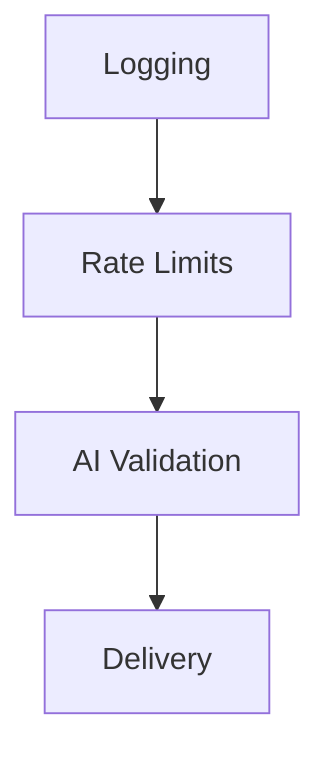

# syn.horse Notifications Pipeline — Core PRD

<!-- markdownlint-disable MD013 -->

## 1. Document Header

| Field      | Value                                                |
| ---------- | ---------------------------------------------------- |
| Name       | syn.horse Notifications Pipeline                     |
| Type       | Core Feature                                         |
| Status     | Draft                                                |
| Author     | Dave Williams (syn@syn.as)                           |
| Created    | 2026-05-15                                           |
| Updated    | 2026-05-15                                           |
| Version    | 1.0.0                                                |
| Repository | `synmux/syn-horse` (worktree branch `notifications`) |

## 2. Executive Summary

### One-liner

A Cloudflare Workers queue consumer that logs, rate-limits, AI-validates, and delivers notification pages from monitoring sources to recipient adapters.

### Overview

The pipeline accepts queue messages emitted by the main `syn.horse` Nuxt site's `/panic` endpoint (and any other internal monitoring source). It logs every message to D1 on receipt, applies per-source rate limits via Cloudflare KV, runs each surviving message through an AI validity check, then routes accepted messages through a pluggable adapter for delivery. Initial adapters (`ntfy`, `pushover`) and the AI stage are stubbed in this release. The six state columns on the D1 log row are populated as the message moves through the pipeline, giving the operator a single queryable history.

### Quick facts

| Item         | Value                                                           |
| ------------ | --------------------------------------------------------------- |
| Platform     | Cloudflare Workers (queue consumer)                             |
| Tech stack   | TypeScript, Zod 4, Cloudflare D1, Cloudflare KV, Workers AI     |
| Bindings     | `DB` (D1), `KV`, `AI`, `send_email`                             |
| Queue name   | `syn-horse-notifications`                                       |
| Branch       | `notifications`                                                 |
| Out of scope | Real AI classification, real adapter sends, retries, dashboards |

## 3. Problem Statement

### Problem

Notification pages from monitoring sources need centralised routing with throttling, observability, and pluggable delivery. Direct sends from each source give no audit trail, no abuse protection, and no place to inject quality control later.

### Current state

The `/panic` route on the main `syn.horse` Nuxt site already enqueues pages onto the `syn-horse-notifications` Cloudflare Queue. The consumer worker (`src/index.ts`) currently parses each batch and acks every message; the body of the handler contains four `TODO` comments for logging, rate limits, AI validation, and adapter dispatch.

### Impact

Without the pipeline:

- Every monitoring source would need to duplicate rate-limit and audit logic.
- There is no record of which pages dropped, why, or how many delivered.
- Spam or runaway senders cannot be throttled.
- Adding a new delivery channel would mean editing every caller.

### Why now

`/panic` already produces messages; the consumer is the missing half. The schema (`src/schema.ts`) and adapter scaffolding (`src/adapters/`) are committed but the queue handler body is empty. Without the pipeline, every page is silently acked.

## 4. Goals and Success Metrics

### Business goals

- Reliable personal pager with a complete audit trail.
- Future-proofed for AI filtering and multi-adapter routing without re-architecture.
- Tunable rate limits via a single code constant (dynamic tuning is a future expansion).

### User goals (operator)

- Query "what dropped, when, and why" in D1 in under 100 ms.
- Tune `RATE_LIMITS` by editing one constant.
- Add a new adapter by writing one file under `src/adapters/`.

### North star metric

100% of received queue messages have a D1 row with a terminal `result` value (`dropped`, `delivered`, or `failed`). Zero "lost in pipeline" cases.

### Specific targets

| Metric                                           | Target   | Measurement source                       |
| ------------------------------------------------ | -------- | ---------------------------------------- |
| Delivery success rate (accepted pages)           | ≥ 99.9%  | `delivered / (delivered + failed)` in D1 |
| Pipeline end-to-end latency, p95                 | < 2 s    | `wrangler tail` timing                   |
| Messages reaching D1 (including KV-failure path) | 100%     | D1 row count vs queue consumed count     |
| Drops-by-source lookup latency (last hour)       | < 100 ms | `EXPLAIN QUERY PLAN` on indexed query    |

## 5. Target Users

### Primary persona — Operator (Dave)

| Attribute   | Detail                                                                                         |
| ----------- | ---------------------------------------------------------------------------------------------- |
| Role        | Personal infrastructure owner                                                                  |
| Goals       | Receive real pages reliably; spot abusive sources; tune the system without breaking it         |
| Pain points | Existing ad-hoc paging is unaudited; cannot answer "did that page deliver?" without log diving |
| Tools       | `wrangler d1 execute`, `wrangler tail`, manual KV inspection                                   |
| Quote       | "If I missed an alert, I want to know why — not guess from a phone that never buzzed."         |

### Secondary persona — Calling systems

Monitoring tools and the `/panic` endpoint on `syn.horse`. They emit JSON matching `messageSchema` in `src/schema.ts` (strict-object validation rejecting unknown keys). They care about: schema stability, ack semantics (every successfully received message is acked), predictable rate-limit feedback (currently none — feedback channel is a future expansion).

### Tertiary persona — Recipients

The people whose `contact` field appears in messages (currently just Dave). They care about: pages arriving without abuse-induced drowning, and only when something matters.

## 6. User Stories and Acceptance Criteria

Five P0 stories. Each uses Given-When-Then.

### US-1 — Log every received page

**As an** operator, **I want** every queue message logged to D1 immediately on receipt, **so that** I have a complete audit trail regardless of how the message is later handled.

Acceptance criteria:

- **Given** a queue message that parses successfully against `messageSchema`, **when** it enters the handler, **then** a D1 row exists with `id`, `contact`, `message`, `source` populated before any stage executes.
- **Given** the same `message.id` arrives twice (queue redelivery), **when** the second arrival is processed, **then** the existing row is preserved (`INSERT OR IGNORE`) and processing continues to Stage 2 normally.

### US-2 — Reject abusive sources

**As an** operator, **I want** sources exceeding `RATE_LIMITS` rejected and logged, **so that** legitimate pages aren't drowned by a single chatty source.

Acceptance criteria:

- **Given** a source has accepted 10 pages in the current hour, **when** an 11th arrives, **then** the D1 row sets `rate_limit_decision='drop'`, `rate_limit_violation='hour'`, `result='dropped'`, and Stages 3 and 4 are skipped.
- **Given** the rejection above, **when** the KV counters are inspected, **then** none of `hour`, `day`, `lifetime` has been incremented by that rejected attempt.
- **Given** both `hour` and `day` would exceed their limits, **when** Stage 2 checks them in order, **then** `rate_limit_violation='hour'` — the first period checked that exceeds wins.

### US-3 — Survive KV outage

**As an** operator, **I want** the pipeline to keep delivering pages when KV is unavailable, **so that** rate-limit infrastructure failure doesn't take down paging.

Acceptance criteria:

- **Given** any KV read or write throws, **when** Stage 2 catches the failure, **then** the D1 row sets `rate_limit_decision='accept'`, `rate_limit_violation='kv_error'`, and processing continues to Stage 3.
- **Given** the failure above, **when** the operator runs `SELECT count(*) FROM log WHERE rate_limit_violation='kv_error'`, **then** the count reflects every affected message.

### US-4 — Stub AI accept (Phase 1)

**As an** operator, **I want** Stage 3 to accept every message that survives Stage 2, **so that** the pipeline is end-to-end testable before Cloudflare AI is wired in.

Acceptance criteria:

- **Given** a message reaches Stage 3, **when** the stub runs, **then** the D1 row sets `ai_decision='accept'`, `ai_violation='none'`, and the message continues to Stage 4.

### US-5 — Stub delivery (Phase 1)

**As an** operator, **I want** Stage 4 to mark messages delivered without performing real I/O, **so that** the pipeline closes the loop on every accepted message.

Acceptance criteria:

- **Given** a message reaches Stage 4, **when** the stub runs, **then** the D1 row sets `adapter='stub'`, `result='delivered'`, and `result_reason` remains `NULL`.

## 7. Scope

### In scope — Phase 1

- Stage 1 logging (D1 `INSERT OR IGNORE` on receipt).
- Stage 2 rate limiting (KV read → check → write-on-accept; KV-failure fallback).
- Stage 3 AI validation as a stub (always accept).
- Stage 4 delivery as a stub (always `adapter='stub'`, `result='delivered'`).
- D1 migration in `migrations/0001_create_log_table.sql`.

### Out of scope

- Real Cloudflare AI classification — deferred to next expansion PRD.
- Real adapter delivery (ntfy, pushover) — deferred to adapter expansion PRD.
- Retry semantics on adapter failure — addressed when real adapters land.
- Per-`contact` rate limits — current model is per-`source` only.
- Page priority differentiation (red/green tier from `/panic`) — currently identical handling.
- Webhook callbacks to senders — no acknowledgement returned beyond the queue ack.
- Web or CLI dashboards — D1 queries via `wrangler d1 execute` for now.
- Spoofing prevention on the `source` field.

## 8. Design and UX

This is a backend pipeline; there is no end-user surface. The "design" is the D1 schema's queryability.

### Observability surface

The single source of truth is the D1 `log` table. Sample queries the operator will run:

```sql
-- Drops by source in the last 1000 rows
SELECT source, rate_limit_violation, count(*) AS n
FROM log
WHERE rate_limit_decision = 'drop'
  AND rowid IN (SELECT rowid FROM log ORDER BY rowid DESC LIMIT 1000)
GROUP BY source, rate_limit_violation
ORDER BY n DESC;

-- Deliveries by adapter
SELECT adapter, result, count(*) AS n
FROM log
WHERE result IS NOT NULL
GROUP BY adapter, result;

-- KV-error count
SELECT count(*) FROM log WHERE rate_limit_violation = 'kv_error';

-- Delivery failures with reasons
SELECT id, adapter, result_reason FROM log WHERE result = 'failed';
```

### Log formatting

Structured JSON via `console.info` / `console.error` (current pattern in `src/index.ts`); field names use `message` not `msg` (per recent refactor `5caf23b`).

### Accessibility

Not applicable.

## 9. Non-Functional Requirements

### Performance

| Aspect                      | Target                      |
| --------------------------- | --------------------------- |
| KV read latency, p95        | < 50 ms                     |
| KV write latency, p95       | < 50 ms                     |
| D1 INSERT + UPDATE, p95     | < 100 ms combined           |
| Total pipeline latency, p95 | < 2 s (queue receipt → ack) |

### Scalability

- Cloudflare Queues default batch size up to 100 messages per invocation; the pipeline must process a full batch within Workers CPU limits.
- D1 row growth ≈ 1 row per message; at personal-pager volumes (≤ 1000 messages per day) this is negligible.
- KV key growth is bounded by `distinct sources × 3 periods`.

### Reliability

- Pipeline must accept on KV failure (Stage 2 KV-failure path).
- Pipeline must always log to D1, including when KV fails.
- Pipeline must not lose messages — if D1 INSERT fails the queue message is not acked (so Cloudflare Queues will redeliver).

### Security

- `messageSchema` uses `z.strictObject` (`src/schema.ts:15`) — unknown keys cause validation failure.
- No payload data outside the schema enters D1.
- `source` is self-reported and informational; spoofing prevention is out of scope at this layer.

### Workers limits

Reference [Cloudflare Workers platform limits](https://developers.cloudflare.com/workers/platform/limits/) for current CPU/memory caps. Per-message work is bounded at: 3 KV reads, ≤ 3 KV writes, 1 D1 INSERT, and 1-3 D1 UPDATEs.

## 10. Risks and Mitigations

| Risk                                         | Probability | Impact | Mitigation                                                                                   | Owner |
| -------------------------------------------- | ----------- | ------ | -------------------------------------------------------------------------------------------- | ----- |
| KV outage                                    | Low         | High   | Accept-and-log with `rate_limit_violation='kv_error'`; pipeline continues.                   | Dave  |
| Queue redelivery causing duplicate D1 INSERT | Medium      | Medium | `INSERT OR IGNORE` keyed on `id` (queue's `message.id`); subsequent UPDATEs are idempotent.  | Dave  |
| Schema-invalid messages bypass D1 audit      | Medium      | Medium | **Open question** — currently `console.error` + ack only. See §14 Q1.                        | Dave  |
| AI false positives (real page marked spam)   | Future      | High   | Queryable `ai_violation` column; manual review backstop; conservative initial prompt tuning. | Dave  |
| AI false negatives (spam passes through)     | Future      | Medium | Rate limits act as a second layer; observed-spam tuning loop.                                | Dave  |
| Adapter failure during delivery              | Future      | Medium | `result='failed'` + free-text `result_reason`; retry strategy decided in §14 Q2.             | Dave  |
| `source` spoofing → rate-limit bypass        | Low         | Low    | Documented as out of scope; senders are trusted internal systems for now.                    | Dave  |
| D1 row growth becomes unbounded              | Low         | Low    | At < 1000 rows/day this is years before any concern; revisit when row count > 10M.           | Dave  |

## 11. Dependencies and Assumptions

### Internal dependencies

| Dependency                  | Binding         | Notes                                                                |
| --------------------------- | --------------- | -------------------------------------------------------------------- |
| Cloudflare D1               | `DB`            | Database `syn-horse-notifications`; migration at `migrations/0001_*` |
| Cloudflare KV               | `KV`            | Namespace `rate-limits:*`                                            |
| Cloudflare Queues           | (consumer only) | Queue `syn-horse-notifications`                                      |
| Cloudflare Workers AI       | `AI`            | Configured but not used in Phase 1                                   |
| `send_email`                | (configured)    | Routed to `syn@syn.as`; not used in Phase 1                          |
| `MEDIA`, `IMAGES`, `STREAM` | (configured)    | Present in `wrangler.jsonc`; not consumed by this pipeline           |

### External dependencies

- Cloudflare platform health (Workers, Queues, D1, KV regional availability).
- ntfy / pushover services (future; not Phase 1).

### Assumptions

- Queue `message.id` is stable across redelivery within a single in-flight window.
- KV eventual consistency is acceptable for rate-limit counters; sub-second drift will not materially affect quota enforcement.
- The `source` field reflects actual source; no spoofing prevention at this layer.
- Operator (Dave) is the sole consumer of D1 logs in Phase 1.

## 12. Technical Specifications

### 12.1 Architecture



A single Cloudflare Worker consumes the `syn-horse-notifications` queue. For each message in the batch, parse against `messageSchema`, then run the four stages sequentially. Each stage updates the D1 row in place.

### 12.2 Data model

D1 table created by `migrations/0001_create_log_table.sql` (SQLite under the hood).

**Columns sourced from the message:**

- `id` — Cloudflare Queues `message.id` (32 hex chars, e.g. `057dd5857e1b0928aa28fcf25d51104e`). **Primary key.** Not in the Zod schema; sourced from `MessageBatch.messages[i].id` in the queue handler.
- `contact` — from `messageSchema.contact`.
- `message` — from `messageSchema.message`.
- `source` — from `messageSchema.source` (nullable: IPv4, IPv6, hostname, or `NULL`).

**State columns (all `NULL` until the relevant stage sets them):**

| Column                 | Values                                                | Set by                                                     |
| ---------------------- | ----------------------------------------------------- | ---------------------------------------------------------- |
| `rate_limit_decision`  | `accept` \| `drop`                                    | Stage 2                                                    |
| `rate_limit_violation` | `none` \| `hour` \| `day` \| `lifetime` \| `kv_error` | Stage 2                                                    |
| `ai_decision`          | `accept` \| `drop`                                    | Stage 3                                                    |
| `ai_violation`         | `none` \| `fun` \| `nonsense` \| `spam`               | Stage 3                                                    |
| `adapter`              | adapter name (e.g. `stub`, `ntfy`)                    | Stage 4                                                    |
| `result`               | `dropped` \| `delivered` \| `failed`                  | Stage 2 or Stage 3 on drop; Stage 4 on delivery or failure |
| `result_reason`        | only used when `result='failed'`; free text           | Stage 4 on failure                                         |

Insert the row with the message data (`id`, `contact`, `message`, `source`) immediately on receipt, before Stage 2 runs. All state columns are `NULL` at insert time; later stages fill them in via `UPDATE`.

### 12.3 Stage 1 — Logging

Capture **every** queue message. Insert into D1 with the message data; leave state columns `NULL`.

If the message fails Zod validation, it does not enter Stage 1 in this version (see §14 Q1). Current behaviour: ack + `console.error`.

### 12.4 Stage 2 — Rate limits

#### Source identifier

KV key format: `rate-limits:SOURCE_IDENTIFIER:TIME_PERIOD`.

- If `source` is set on the message, `SOURCE_IDENTIFIER` is its value (e.g. `123.45.67.89`).
- If `source` is missing, `SOURCE_IDENTIFIER` is the literal string `unknown`; all sourceless messages share this single bucket.

#### Limits

`RATE_LIMITS` is a static constant in the code:

```ts
const RATE_LIMITS = {
  hour: 10,
  day: 100,
  lifetime: 1000,
} as const
```

#### Flow

For each message, evaluate the three time periods in order: `hour`, `day`, `lifetime`.

1. **Read** `rate-limits:SOURCE_IDENTIFIER:hour`, `rate-limits:SOURCE_IDENTIFIER:day`, `rate-limits:SOURCE_IDENTIFIER:lifetime` from KV.
   - KV returns values as strings; parse each to an integer.
   - A missing key counts as `0` (no need to write anything yet).
2. **Check** each value against `RATE_LIMITS[period]` in order (`hour`, then `day`, then `lifetime`).
   - If `value >= RATE_LIMITS[period]` for any period — i.e. incrementing would push it over the limit — **reject** the message:
     - Update the D1 row for this message ID:
       - `rate_limit_decision = 'drop'`
       - `rate_limit_violation = '<period>'` (the first period that hit its limit)
       - `result = 'dropped'`
     - Drop the message. Do **not** increment any KV counter. Skip Stages 3 and 4.
3. **Accept**: if all three values are below their limits, increment each counter and write it back:
   - For each period, write `value + 1` to `rate-limits:SOURCE_IDENTIFIER:<period>`. KV expects strings; convert.
   - On the **first** write to a key (it didn't exist on read), set the expiration:
     - `hour`: absolute UNIX time = now + 3600 seconds.
     - `day`: absolute UNIX time = now + 86400 seconds.
     - `lifetime`: **no expiration** — omit both `expiration` and `expirationTtl`.
   - On **subsequent** writes (the key already existed), **do not modify the expiration** — just write the new value.
   - Update the D1 row for this message ID:
     - `rate_limit_decision = 'accept'`
     - `rate_limit_violation = 'none'`
   - Continue to Stage 3.

#### KV failure handling

If any KV read or write fails (network error, KV unavailable, malformed value, etc.):

- Update the D1 row:
  - `rate_limit_decision = 'accept'`
  - `rate_limit_violation = 'kv_error'`
- Accept the message and continue to Stage 3.

This keeps traffic flowing during KV outages and makes those outages queryable in D1 (`WHERE rate_limit_violation = 'kv_error'`).

#### Gotchas

- Limits are set in the `RATE_LIMITS` constant above.
- Never modify a key's expiration once it's set — only write the new value on subsequent updates.
- Always log to D1, including when KV operations fail.
- Counters only increment on accept; rejected requests do not consume quota in longer windows.

### 12.5 Stage 3 — AI validation

**Phase 1 stub:**

- Set `ai_violation` to `none`.
- Set `ai_decision` to `accept`.
- Accept the message; continue to Stage 4.

**Note for later — when Cloudflare AI is wired in:**

When logging the AI classification to D1, for:

- A real page
  - Set `ai_violation` to `none`.
  - Set `ai_decision` to `accept`.
  - Continue to Stage 4.
- Someone having fun
  - Set `ai_violation` to `fun`.
  - Set `ai_decision` to `accept`.
  - Continue to Stage 4.
- Nonsensical content
  - Set `ai_violation` to `nonsense`.
  - Set `ai_decision` to `drop`.
  - Set `result` to `dropped`.
  - Skip Stage 4.
- Spam
  - Set `ai_violation` to `spam`.
  - Set `ai_decision` to `drop`.
  - Set `result` to `dropped`.
  - Skip Stage 4.

### 12.6 Stage 4 — Delivery

**Phase 1 stub:**

- Set `adapter` to `stub`.
- Set `result` to `delivered`.

**Note for later — when real adapters are wired in:**

When logging to D1:

- Set `adapter` to the name of the adapter used to attempt delivery (e.g. `ntfy`, `pushover`).
- Where delivery succeeds
  - Set `result` to `delivered`.
- Where delivery fails
  - Set `result` to `failed`.
  - Set `result_reason` to the reason it failed (free text).

### 12.7 File map

| Path                                   | Role                                                |
| -------------------------------------- | --------------------------------------------------- |
| `src/index.ts`                         | Queue handler entry point                           |
| `src/schema.ts`                        | `messageSchema` (Zod)                               |
| `src/types.ts`                         | `Adapter` interface                                 |
| `src/adapters/index.ts`                | `getAdapter` factory                                |
| `src/adapters/ntfy.ts`                 | ntfy adapter stub (returns `true`)                  |
| `src/adapters/pushover.ts`             | pushover adapter stub (returns `true`)              |
| `migrations/0001_create_log_table.sql` | D1 migration creating the `log` table               |
| `wrangler.jsonc`                       | Bindings (D1, KV, AI, `send_email`, queue consumer) |

## 13. Analytics and Experimentation

### Event model

Each row in the `log` table is one event. There is no separate analytics pipeline; the D1 columns capture everything.

Implicit "events" derivable from columns:

- `received` — every row's existence.
- `rate_limited` — `rate_limit_decision='drop'`.
- `ai_dropped` — `ai_decision='drop'`.
- `delivered` — `result='delivered'`.
- `failed` — `result='failed'`.

### Dashboards

The operator runs ad-hoc SQL via `wrangler d1 execute` (sample queries in §8). A future expansion may add a Nuxt dashboard at `/panic/log` on the main `syn.horse` site, but it is out of scope for Phase 1.

### Experimentation

Not applicable in Phase 1. Future expansions may A/B test:

- AI prompt variants for the Stage 3 classifier.
- Rate-limit tunings (e.g. relaxed lifetime cap).
- Adapter selection heuristics.

## 14. Open Questions

| #   | Question                                                                              | Owner | Options                                                                                                | Recommendation                                                             |
| --- | ------------------------------------------------------------------------------------- | ----- | ------------------------------------------------------------------------------------------------------ | -------------------------------------------------------------------------- |
| Q1  | Should schema-invalid messages still produce a D1 row (with a `malformed` sentinel)?  | Dave  | (a) Stay silent — `console.error` only (current); (b) Insert a row with a sentinel for visibility      | (b) — preserves "100% of received messages land in D1" as a hard invariant |
| Q2  | What's the retry strategy when an adapter call fails?                                 | Dave  | (a) `message.retry()` with exponential backoff up to N times; (b) One-shot — `result='failed'` and ack | Decide when real adapters land; one-shot is simplest for Phase 2           |
| Q3  | Should `/panic` red vs green priority pages receive different handling?               | Dave  | (a) Identical; (b) Separate adapter selection; (c) Separate quotas                                     | (a) for Phase 1 — revisit when adapter-selection logic exists              |
| Q4  | When AI tags `ai_violation='fun'` with `ai_decision='accept'`, should routing differ? | Dave  | (a) Identical to "real page" delivery; (b) Route to a lower-priority adapter                           | (a) for first AI rollout — observe `fun` rate before complicating          |

## 15. Change Log

| Version | Date       | Notes                                                                                |
| ------- | ---------- | ------------------------------------------------------------------------------------ |
| 1.0.0   | 2026-05-15 | Initial PRD; derived from `TASK.md` after two rounds of disambiguation; replaces it. |
