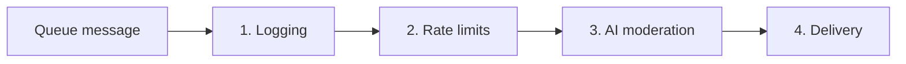

# syn-horse-notifications

A Cloudflare Workers queue consumer that filters and delivers paging
messages through a four-stage pipeline: **logging → rate limits → AI
moderation → delivery**.

This is the personal paging backend for [syn.horse]. Producers POST a
small JSON payload to a Cloudflare queue; the consumer logs it to D1,
enforces per-source rate limits in KV, classifies it with an LLM, and
delivers it through a pluggable adapter (currently a no-op stub; ntfy
and Pushover adapters are scaffolded).

[syn.horse]: https://syn.horse

## Pipeline



1. **Logging** — insert an audit row into the D1 `log` table. Every
   message is recorded _before_ any decision is taken, so a failure in
   a later stage still leaves a trail.
2. **Rate limits** — read three per-source counters from KV (`hour`,
   `day`, `lifetime`), drop the message if any cap is hit, increment if
   all are under. **Fail-open** on KV errors: better to wake the operator
   on noise during a KV incident than to silently lose pages. The outage
   is queryable in D1 as `rate_limit_violation = 'kv_error'`.
3. **AI moderation** _(stubbed)_ — classify the message as `none`,
   `fun`, `nonsense`, or `spam` via an LLM. Stricter on the `red`
   channel (delivered while the operator is asleep) than on `green`
   (only delivered while awake). The prompt is tuned for Llama-class
   small models.
4. **Delivery** _(stubbed)_ — hand the message off to an `Adapter`
   (`ntfy`, `pushover`, or `stub`).

## Message format

Producers send JSON matching the Zod schema in [`src/schema.ts`]:

```json
{
  "channel": "red",
  "contact": "alerts@example.com",
  "message": "Need your help! Site is down.",
  "source": "monitoring.example.com"
}
```

- `channel` — `"red"` (urgent; delivered even while the operator is
  asleep) or `"green"` (only delivered while awake).
- `contact` — free-form identifier of who is paging. 1–256 chars,
  trimmed.
- `message` — the page body. 1–8192 chars, trimmed.
- `source` — optional. Hostname (RFC-1123), IPv4, or IPv6 address. Used
  as the rate-limit bucket; omitting it puts the page in a shared
  `"unknown"` bucket. **Omitting `source` is not a rate-limit bypass.**

Unknown fields are rejected (`z.strictObject`). Malformed payloads are
acknowledged and logged but not retried — no amount of replay can make
a bad schema valid.

[`src/schema.ts`]: src/schema.ts

## Audit table

[`migrations/0001_create_log_table.sql`] defines a single `log` table
keyed by the Cloudflare Queues `message.id`. Each pipeline stage
`UPDATE`s the same row, building up the audit trail incrementally.

| Column                                          | Set by                  | Possible values                                       |
| ----------------------------------------------- | ----------------------- | ----------------------------------------------------- |
| `id`, `contact`, `message`, `channel`, `source` | logging                 | from the message                                      |
| `rate_limit_decision`                           | rate limits             | `accept` \| `drop`                                    |
| `rate_limit_violation`                          | rate limits             | `none` \| `hour` \| `day` \| `lifetime` \| `kv_error` |
| `ai_decision`                                   | AI                      | `accept` \| `drop`                                    |
| `ai_violation`                                  | AI                      | `none` \| `fun` \| `nonsense` \| `spam`               |
| `adapter`                                       | delivery                | adapter name (`stub`, `ntfy`, ...)                    |
| `result`                                        | terminal stage          | `dropped` \| `delivered` \| `failed`                  |
| `result_reason`                                 | delivery on failure     | free text                                             |
| `created_at`                                    | `DEFAULT (unixepoch())` | Unix seconds                                          |

`CHECK` constraints on the enum-valued columns enforce the value sets
at the database level.

[`migrations/0001_create_log_table.sql`]: migrations/0001_create_log_table.sql

## Rate limits

Per-source caps, hard-coded in [`src/constants.ts`]:

| Window     | Cap  | TTL           |
| ---------- | ---- | ------------- |
| `hour`     | 10   | 3600s         |
| `day`      | 100  | 86400s        |
| `lifetime` | 1000 | never expires |

KV keys are namespaced as `rate-limits:<source-or-"unknown">:<period>`.
Counters are stored as strings; on the first write an absolute
`expiresAt` is recorded in metadata so subsequent writes preserve the
**original** window rather than sliding it forward each time.

Counters increment on accept only — rejected messages don't consume
quota in the longer windows.

[`src/constants.ts`]: src/constants.ts

## AI moderation

Stage 3 is stubbed: today it records `accept` / `none` for every
message. The production wiring will render the `PROMPT` template in
[`src/stages/ai.ts`] with the message body and channel, send it to an
OpenAI-compatible endpoint, and map the response to one of four labels:

| Label      | Outcome                                                 |
| ---------- | ------------------------------------------------------- |
| `none`     | accept — real page, continue to delivery                |
| `fun`      | accept — joke or non-serious, continue to delivery      |
| `nonsense` | drop — incoherent, terminal `result = 'dropped'`        |
| `spam`     | drop — advertising/abuse, terminal `result = 'dropped'` |

The prompt is deliberately structured for less capable models
(Llama-class ~7-8B): flat bullets only, five few-shot examples covering
all four labels and both channels, the four valid labels restated
immediately before the live query, and an explicit `Output:` anchor so
the model continues from that token rather than emitting commentary.
Message bodies are wrapped in triple-backtick code fences as a soft
prompt-injection defence.

[`src/stages/ai.ts`]: src/stages/ai.ts

## Adapters

| Name       | Status | Notes                                                                                                                                                    |
| ---------- | ------ | -------------------------------------------------------------------------------------------------------------------------------------------------------- |
| `stub`     | live   | Intentional no-op; always returns `true`. Used by the delivery stage today for dev and tests.                                                            |
| `email`    | stub   | Returns `true` without sending. Will dispatch through the Cloudflare Email Workers binding (`env.EMAIL`, declared in `wrangler.jsonc` via `send_email`). |
| `ntfy`     | stub   | Returns `true` without contacting ntfy. Will POST to a configured topic.                                                                                 |
| `pushover` | stub   | Returns `true` without contacting Pushover. Will call the messages API with configured user/app keys.                                                    |

Lookup is via an exhaustive `switch` in [`src/adapters/index.ts`] —
adding an adapter is a deliberate code change rather than a runtime
side-effect of an import.

[`src/adapters/index.ts`]: src/adapters/index.ts

## Running locally

Prerequisites: [Bun] and a Cloudflare account configured with the
bindings declared in [`wrangler.jsonc`] (D1 database, KV namespace,
queue, Email Workers destination).

```bash
bun install
bun run dev
```

`bun run dev` starts Wrangler and auto-applies local D1 migrations, so
`bun run db:migrate:local` is usually unnecessary.

[Bun]: https://bun.sh
[`wrangler.jsonc`]: wrangler.jsonc

### Useful scripts

| Command                    | What it does                           |
| -------------------------- | -------------------------------------- |
| `bun run dev`              | Local Wrangler dev server              |
| `bun run lint`             | ESLint + trunk + tsc                   |
| `bun run lint:fix`         | Autofix ESLint + trunk                 |
| `bun run lint:types`       | TypeScript typecheck only              |
| `bun run format`           | Prettier + trunk format                |
| `bun run types`            | Regenerate `worker-configuration.d.ts` |
| `bun run deploy`           | Deploy to Cloudflare                   |
| `bun run db:migrate`       | Apply D1 migrations to remote          |
| `bun run db:migrate:local` | Apply D1 migrations locally            |

### Configuration

Bindings (declared in `wrangler.jsonc`):

- **D1** (`DB`) — `syn-horse-notifications` database
- **KV** (`KV`) — per-source rate-limit counters
- **Workers AI** (`AI`) — reserved; the moderation stage may use an
  OpenAI-compatible endpoint instead
- **Media / Images / Stream** (`MEDIA`, `IMAGES`, `STREAM`) — reserved
- **Email Workers** (`send_email`) — verified destination `syn@syn.as`; bound as `env.EMAIL`; consumed (once wired) by the `email` adapter.
- **Queue consumer** — `syn-horse-notifications`

Re-run `bun run types` after any binding change to keep
`worker-configuration.d.ts` in sync.

Environment variables — see [`.env.example`]. Required for migrations
from the host: `CLOUDFLARE_ACCOUNT_ID`, `CLOUDFLARE_DATABASE_ID`,
`CLOUDFLARE_D1_TOKEN`. Additional API keys (OpenRouter, Anthropic,
Linear, ControlD, Turnstile, Sentry) are placeholders as the project
grows.

[`.env.example`]: .env.example

## Status

This repo is mid-development.

- **Live**: queue handler, message validation, logging stage, rate-limit
  stage (with fail-open on KV errors), D1 audit schema.
- **Stubbed (scaffolded, not yet sending)**: AI moderation (`runAi`
  returns `accept`/`none`), and the three real delivery adapters
  (`email`, `ntfy`, `pushover`). `runDelivery` is hard-wired to the
  `stub` adapter, which is an intentional no-op that works as designed.
- **Ready but not wired**: the Llama-tuned moderation prompt in
  `src/stages/ai.ts`, awaiting an offline eval before the live call is
  switched on.

## Repository layout

```text
src/
  index.ts          — queue handler (entry point)
  schema.ts         — inbound message Zod schema
  types.ts          — Adapter interface, Notification type
  constants.ts      — rate-limit caps, TTLs, KV key builder
  db.ts             — D1 INSERT/UPDATE helpers
  kv.ts             — KV counter read/write with TTL preservation
  stages/
    types.ts        — CONTINUE/STOP singletons
    logging.ts      — stage 1
    rate-limits.ts  — stage 2
    ai.ts           — stage 3 (stubbed; prompt ready)
    delivery.ts     — stage 4 (stubbed; uses stub adapter)
  adapters/
    index.ts        — registry (exhaustive switch)
    stub.ts         — intentional no-op adapter (live; used by runDelivery)
    email.ts        — Cloudflare Email Workers adapter (stub)
    ntfy.ts         — ntfy.sh adapter (stub)
    pushover.ts     — Pushover adapter (stub)
migrations/
  0001_create_log_table.sql
wrangler.jsonc      — bindings + queue config
AGENTS.md           — context for AI coding agents
README.md           — this file
```

## Contributing

Code style: TypeScript strict mode, Prettier-formatted, ESLint-clean.
Every exported declaration in `src/` carries a JSDoc block (see the
project conventions in [`AGENTS.md`]).

Commits use GitMoji + [Conventional Commits]. The CI workflows under
[`.github/workflows`] run lint and the Claude code review.

[`AGENTS.md`]: AGENTS.md
[Conventional Commits]: https://www.conventionalcommits.org
[`.github/workflows`]: .github/workflows

## License

[MIT](LICENSE).
