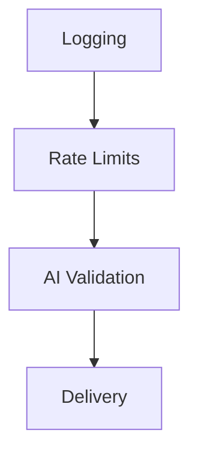

# Task

<!-- markdownlint-disable MD013 -->

We have a multi-stage system. We're going to pass through four stages.

## Stage 1: Logging

We want to capture **ALL** requests to the log. We will use D1. Column names can be taken from the Zod schema directly. We will need additional columns:

- `rate_limit_decision`
- `rate_limit_violation`
- `ai_decision`
- `ai_violation`
- `adapter`
- `result`

The primary key will be the message ID. An example message ID is `057dd5857e1b0928aa28fcf25d51104e`.

We need to create a D1 migration for the log. There is a migration in `migrations/0001_create_log_table.sql` you can write to. Remember it's sqlite behind the scenes.

Log the request with all the data from the message object, leaving the other fields blank. We'll make changes to it as we process it.

## Stage 2: Rate Limits

The message comes with the hostname/IP/IPv6 of the requesting host. We need to keep track of rate limits.

We'll use Cloudflare KV for this.

- We have a `KV` binding for access to KV.
- Our keys will be of format `namespace:key`.
  - These may extend to `namespace:key:subkey` in a hierarchy.

We'll use namespace `rate-limits`.

When we receive a message -

- attempt to read `rate-limits:SOURCE_IDENTIFIER:TIME_PERIOD` for all `TIME_PERIOD`.
  - TIME_PERIOD may be `hour`, `day`, or `lifetime`.
  - For example `rate-limits:123.45.67.89:hour`
  - If any don't exist -
    - write `0` to it and set the expiration by `TIME_PERIOD`.
      - Expiration is set as UNIX time, so `hour` will be the current UNIX time plus 3600 seconds.
  - KV returns values as strings. We'll need to parse the result into an integer.
- Increment the integer by `1` and write it back to KV, again navigating types.
- Evaluate the `TIME_PERIOD`s in this order: hour, day, lifetime.
- If any `TIME_PERIOD` exceeds the limit (e.g. `10` requests per `hour`), reject the message.
  - Write to D1, updating the existing line for this message ID.
    - Set `rate_limit_decision` to `drop`.
    - Set `rate_limit_violation` to the `TIME_PERIOD` the violation occurred in.
    - Set `result` to `drop`.
  - Drop the message, not performing any further processing.
- If all `TIME_PERIOD` are within the limit:
  - set `rate_limit_violation` to `none`.
  - Set `rate_limit_decision` to `accept`.
  - Accept the message, moving to the next stage of processing.

### Rate Limit Gotchas

- Limits are set in a static object in the code, a constant `RATE_LIMITS`.
- Make sure that we never modify the expiration time once it's set.
- Make sure we always log to D1, including if KV operations fail.
- If we're unable to read or write to or from KV, log to D1 and accept the message.

## Stage 3: AI Validation

Stub this for now:

- Set `ai_violation` to `none`.
- Set `ai_decision` to `accept`.
- Accept the message, moving to the next stage of processing.

We will implement this later, sending each message which passes rate limits to Cloudflare AI to decide whether it's a real page, someone having fun, spam, or nonsensical.

## Stage 4: Delivery

Stub this for now:

- Set `adapter` to `stub`.
- Set `result` to `delivered`.

We will implement this later, delivering through the `Adapter` pattern.
