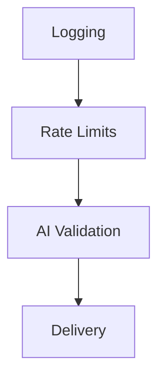

# Task

<!-- markdownlint-disable MD013 -->

We have a multi-stage system. We're going to pass through four stages.



## Stage 1: Logging

We want to capture **ALL** requests to the log. We will use D1.

### Columns

The columns are derived from the Zod schema in `src/schema.ts` plus state columns we populate as the message moves through later stages.

From the message:

- `id` — Cloudflare Queues `message.id` (32 hex chars, e.g. `057dd5857e1b0928aa28fcf25d51104e`). **Primary key.** Not in the Zod schema; sourced from `MessageBatch.messages[i].id` in the queue handler.
- `contact` — from `messageSchema.contact`.
- `message` — from `messageSchema.message`.
- `source` — from `messageSchema.source` (nullable: IPv4, IPv6, hostname, or `NULL` when omitted).

State columns (all `NULL` until the relevant stage sets them):

| Column                 | Values                                                         | Set by                                                     |
| ---------------------- | -------------------------------------------------------------- | ---------------------------------------------------------- |
| `rate_limit_decision`  | `accept` \| `drop`                                             | Stage 2                                                    |
| `rate_limit_violation` | `none` \| `hour` \| `day` \| `lifetime` \| `kv_error`          | Stage 2                                                    |
| `ai_decision`          | `accept` \| `drop`                                             | Stage 3                                                    |
| `ai_violation`         | `none` \| `fun` \| `nonsense` \| `spam`                        | Stage 3                                                    |
| `adapter`              | adapter name (e.g. `stub`, `ntfy`)                             | Stage 4                                                    |
| `result`               | `dropped` \| `delivered` \| `failed`                           | Stage 2 or Stage 3 on drop; Stage 4 on delivery or failure |
| `result_reason`        | only used when `result` is `failed`. why it failed. free text. | Stage 4 on failure                                         |

We need to create the D1 migration in `migrations/0001_create_log_table.sql`. Remember it's SQLite behind the scenes.

Insert the row with the message data (`id`, `contact`, `message`, `source`) immediately on receipt, before Stage 2 runs. All state columns are `NULL` at insert time and are filled in via `UPDATE` as later stages execute.

## Stage 2: Rate Limits

The message may come with the hostname/IP/IPv6 of the requesting host in the `source` field. We need to keep track of rate limits.

We'll use Cloudflare KV for this.

- We have a `KV` binding for access to KV.
- Our keys are of format `namespace:key`.
  - These may extend to `namespace:key:subkey` in a hierarchy.

We'll use namespace `rate-limits`.

### Source identifier

The KV key is `rate-limits:SOURCE_IDENTIFIER:TIME_PERIOD`.

- If `source` is set on the message, `SOURCE_IDENTIFIER` is its value (e.g. `123.45.67.89`).
- If `source` is missing, `SOURCE_IDENTIFIER` is the literal string `unknown`. All sourceless messages share this single bucket.

### Limits

`RATE_LIMITS` is a static constant in the code:

```ts
const RATE_LIMITS = {
  hour: 10,
  day: 100,
  lifetime: 1000,
} as const
```

### Flow

For each message, evaluate the three time periods in order: `hour`, `day`, `lifetime`.

1. **Read** `rate-limits:SOURCE_IDENTIFIER:hour`, `rate-limits:SOURCE_IDENTIFIER:day`, and `rate-limits:SOURCE_IDENTIFIER:lifetime` from KV.
   - KV returns values as strings. Parse each to an integer.
   - A missing key counts as `0` (no need to write anything yet).
2. **Check** each value against `RATE_LIMITS[period]` in order (`hour`, then `day`, then `lifetime`).
   - If `value >= RATE_LIMITS[period]` for any period — i.e. incrementing would push it over the limit — **reject** the message:
     - Update the D1 row for this message ID:
       - `rate_limit_decision = 'drop'`
       - `rate_limit_violation = '<period>'` (the first period that hit its limit)
       - `result = 'dropped'`
     - Drop the message. Do **not** increment any KV counter. Skip Stages 3 and 4.
3. **Accept**: if all three values are below their limits, increment each counter and write it back:
   - For each period, write `value + 1` to `rate-limits:SOURCE_IDENTIFIER:<period>`. KV expects strings; convert.
   - On the **first** write to a key (it didn't exist on read), set the expiration:
     - `hour`: absolute UNIX time = now + 3600 seconds.
     - `day`: absolute UNIX time = now + 86400 seconds.
     - `lifetime`: **no expiration** — omit both `expiration` and `expirationTtl`.
   - On **subsequent** writes (the key already existed), **do not modify the expiration** — just write the new value.
   - Update the D1 row for this message ID:
     - `rate_limit_decision = 'accept'`
     - `rate_limit_violation = 'none'`
   - Continue to Stage 3.

### KV failure handling

If any KV read or write fails (network error, KV unavailable, malformed value, etc.):

- Update the D1 row:
  - `rate_limit_decision = 'accept'`
  - `rate_limit_violation = 'kv_error'`
- Accept the message and continue to Stage 3.

This keeps traffic flowing during KV outages and makes those outages queryable in D1 (`WHERE rate_limit_violation = 'kv_error'`).

### Rate Limit Gotchas

- Limits are set in a static object in the code, the `RATE_LIMITS` constant above.
- Never modify a key's expiration once it's set — only write the new value on subsequent updates.
- Always log to D1, including when KV operations fail.
- Counters only increment on accept; rejected requests do not consume quota in longer windows.

## Stage 3: AI Validation

Stub this for now:

- Set `ai_violation` to `none`.
- Set `ai_decision` to `accept`.
- Accept the message, moving to the next stage of processing.

We will implement this later, sending each message which passes rate limits to Cloudflare AI to decide whether it's a real page, someone having fun, spam, or nonsensical.

Note for later: when we log to D1, for:

- A real page
  - Set `ai_violation` to `none`.
  - Set `ai_decision` to `accept`.
  - Continue to Stage 4.
- Someone having fun
  - Set `ai_violation` to `fun`.
  - Set `ai_decision` to `accept`.
  - Continue to Stage 4.
- Nonsensical content
  - Set `ai_violation` to `nonsense`.
  - Set `ai_decision` to `drop`.
  - Set `result` to `dropped`.
  - Skip Stage 4.
- Spam
  - Set `ai_violation` to `spam`.
  - Set `ai_decision` to `drop`.
  - Set `result` to `dropped`.
  - Skip Stage 4.

## Stage 4: Delivery

Stub this for now:

- Set `adapter` to `stub`.
- Set `result` to `delivered`.

We will implement this later, delivering through the `Adapter` pattern.

Note for later: when we log to D1:

- Set `adapter` to the name of the adapter used to attempt delivery (e.g. `ntfy`, `pushover`).
- Where delivery succeeds
  - Set `result` to `delivered`.
- Where delivery fails
  - Set `result` to `failed`.
  - Set `result_reason` to the reason it failed (free text).
